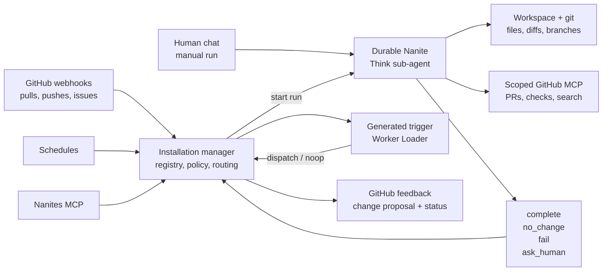

<p align="center">
  
</p>

<h1 align="center">Nanites</h1>

<p align="center">
  Small durable agents that maintain GitHub repositories under one installation.
</p>

<p align="center">
  <a href="docs/architecture/README.md">Architecture</a> ·
  <a href="docs/architecture/execution-architecture.md">Execution model</a> ·
  <a href="docs/architecture/roadmap.md">Roadmap</a> ·
  <a href="docs/development.md">Development</a>
</p>

<p align="center">
  
  
  
  
  
</p>

Nanites are named, durable collaborators for repository maintenance. Each one owns a narrow
vertical: a docs page family, package area, smoke path, CI guard, release lane, or other repeated
workflow that should stay legible and reviewable.

The app is a Cloudflare Worker runtime backed by Durable Objects, D1, R2, Workers AI/Think, Worker
Loader, and GitHub App installation auth. Sigvelo routes events and policy. The Nanite owns the
work.

## Why Nanites

| Need                   | Nanites answer                                                                          |
| ---------------------- | --------------------------------------------------------------------------------------- |
| Many small maintainers | One GitHub installation can host many narrow durable agents.                            |
| Clear ownership        | Each Nanite has a scope, soul, stop conditions, and visible run outcome.                |
| Programmable intake    | Generated trigger handlers decide whether GitHub events or schedules should start work. |
| Durable execution      | Think sub-agents keep the transcript, memory, workspace, and lifecycle boundary.        |
| Scoped authority       | GitHub App permissions and repository grants derive the available runtime tools.        |
| Reviewable output      | GitHub stays the artifact surface for change proposals, checks, and reviewer action.    |

## Quick Start

Install dependencies:

```bash
vp install
```

Run the local app:

```bash
vp run dev
```

Validate changes before publishing:

```bash
vp check
vp test
```

Most project commands run through `vp` from the repository root:

```bash
vp dev
vp build
vp test
```

## Runtime Model



Generated triggers route machine-originated events. They do not edit repositories, own lifecycle
state, or bypass manager policy. Chat, manual runs, and operator steering go directly to the durable
Nanite agent.

## What Gets Authored

A Nanite definition stays thin. The authoring model describes identity, coarse event intake,
repository scope, GitHub permissions, and the generated trigger source:

```ts
{
  manifest: {
    name: "React WebMCP docs syncer",
    description: "Keeps React WebMCP docs aligned with package changes.",
    eventSource: {
      type: "github",
      events: ["push"],
      repositories: ["WebMCP-org/npm-packages"],
      branches: ["main"],
    },
    permissions: {
      github: {
        repositories: ["WebMCP-org/npm-packages", "WebMCP-org/docs"],
        appPermissions: {
          contents: "write",
          pull_requests: "write",
          actions: "read",
        },
      },
    },
    triggerSource: "...",
  },
  enabled: true,
}
```

The `eventSource` block is a cheap candidate filter. The root `triggerSource` TypeScript decides
whether a machine event should dispatch the Nanite.

## Product Surfaces

| Surface            | Purpose                                                                                   |
| ------------------ | ----------------------------------------------------------------------------------------- |
| Browser app        | GitHub sign-in, installation selection, Nanite roster, and live Nanite chat.              |
| MCP tools          | Model-facing creation, inspection, testing, cancellation, and debugging workflows.        |
| GitHub app         | Installation auth, webhook intake, scoped tokens, and native review feedback.             |
| Cloudflare runtime | Durable manager, durable Nanites, generated triggers, workspace files, and product state. |

## Repository Map

| Path                       | Owner                                                                                      |
| -------------------------- | ------------------------------------------------------------------------------------------ |
| `src/backend/browser-auth` | GitHub OAuth, session cookies, selected installation state, and Agents SDK request auth.   |
| `src/backend/db`           | D1 client, Drizzle business schema, migrations, and business-data mutations.               |
| `src/backend/mcp`          | Sigvelo MCP OAuth, auth props, and MCP server registration.                                |
| `src/backend/nanites`      | Nanite manager, Think sub-agent runtime, manager chat, trigger execution, and tool policy. |
| `src/backend/github.ts`    | GitHub App/OAuth integration, webhook intake, installation tokens, and repository listing. |
| `src/frontend`             | Product UI, browser routes, and app-local UI primitives.                                   |
| `plugins/nanites`          | Model-facing plugin manifests, commands, skills, and examples.                             |
| `docs/architecture`        | Product model, execution architecture, roadmap, and user stories.                          |

## Brand Assets

| Asset                                        | Use                                                        |
| -------------------------------------------- | ---------------------------------------------------------- |
| `public/assets/nanite.svg`                   | Animated SVG banner for README and documentation surfaces. |
| `src/frontend/ui/components/NaniteScene.tsx` | GSAP-backed React SVG scene used in product states.        |
| `src/frontend/ui/styles/nanite-scene.css`    | Shared motion and layout styles for the Nanite scene.      |

## Cloudflare Setup

`wrangler.jsonc` declares the required Cloudflare bindings:

- Durable Objects for manager and agent state
- D1 database for product state
- R2 bucket for workspace files
- KV namespace for MCP OAuth state
- Worker Loader, Browser, and Workers AI bindings

Create resources with Wrangler, update `wrangler.jsonc`, then set required secrets:

```bash
vp exec wrangler d1 create nanites-db
vp exec wrangler r2 bucket create nanites-workspace-files
vp exec wrangler kv namespace create OAUTH_KV
vp exec wrangler secret put AUTH_COOKIE_SECRET --config wrangler.jsonc
vp exec wrangler secret put GITHUB_APP_PRIVATE_KEY --config wrangler.jsonc
vp exec wrangler secret put GITHUB_CLIENT_SECRET --config wrangler.jsonc
vp exec wrangler secret put GITHUB_WEBHOOK_SECRET --config wrangler.jsonc
```

See [docs/development.md](docs/development.md) for the detailed local setup.
