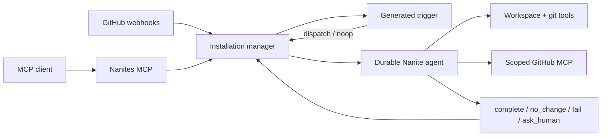

# Nanites

Nanites are small durable agents that run under a GitHub installation. Each Nanite owns one narrow maintenance surface: a docs page family, package area, smoke path, CI guard, release lane, or other repeated repository workflow.

The runtime is a Cloudflare Worker app. It uses Durable Objects for the installation manager and long-lived Nanite agents, D1 for product state, R2 for workspace files, Workers AI/Think for agent execution, and GitHub App auth for repository access.

## Runtime Model



Generated triggers route machine events. They do not edit repositories or own lifecycle state. Chat, manual runs, and operator steering go directly to the durable Nanite agent.

## Repository Layout

- `src` - Cloudflare Worker app with GitHub auth, Nanites runtime, MCP tools, product UI, admin views, and observability.
- `packages/contracts` - shared schemas, branded IDs, and API contracts.
- `packages/db` - Drizzle schema, D1 migrations, and database helpers.
- `packages/domain` - shared domain enums and value contracts.
- `packages/observability` - logging and OpenTelemetry helpers.
- `packages/ui` and `packages/design-tokens` - reusable React components and CSS tokens used by the app.
- `plugins/nanites` - model-facing plugin manifests, commands, skills, and examples.
- `docs/architecture` - architecture notes, roadmap, execution model, and source references.

## Development

Install dependencies:

```bash
vp install
```

Run the app locally:

```bash
vp run dev
```

Validate changes:

```bash
vp check
vp test
```

App commands run from the repository root:

```bash
vp dev
vp build
vp test
```

## Cloudflare Setup

`wrangler.jsonc` declares the required Cloudflare bindings:

- Durable Objects for manager and agent state
- D1 database for product state
- R2 bucket for workspace files
- KV namespace for MCP OAuth state
- Worker Loader, Browser, and Workers AI bindings

Create resources with Wrangler, update `wrangler.jsonc`, then set required secrets:

```bash
vp exec wrangler d1 create nanites-db
vp exec wrangler r2 bucket create nanites-workspace-files
vp exec wrangler kv namespace create OAUTH_KV
vp exec wrangler secret put AUTH_COOKIE_SECRET --config wrangler.jsonc
vp exec wrangler secret put GITHUB_APP_PRIVATE_KEY --config wrangler.jsonc
vp exec wrangler secret put GITHUB_CLIENT_SECRET --config wrangler.jsonc
vp exec wrangler secret put GITHUB_WEBHOOK_SECRET --config wrangler.jsonc
```

See [docs/development.md](docs/development.md) for the detailed app setup.
