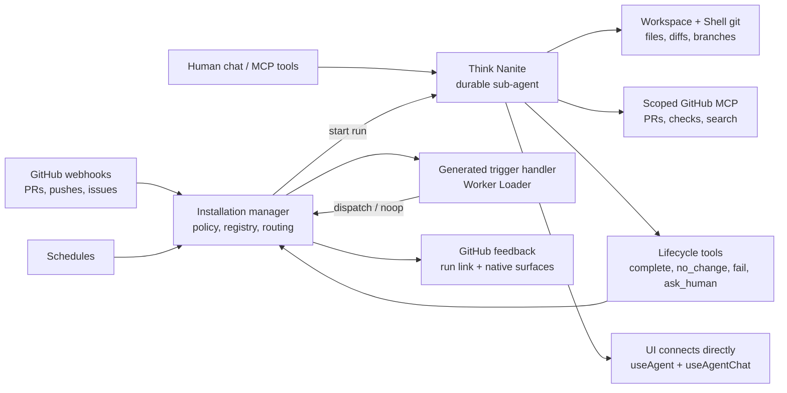
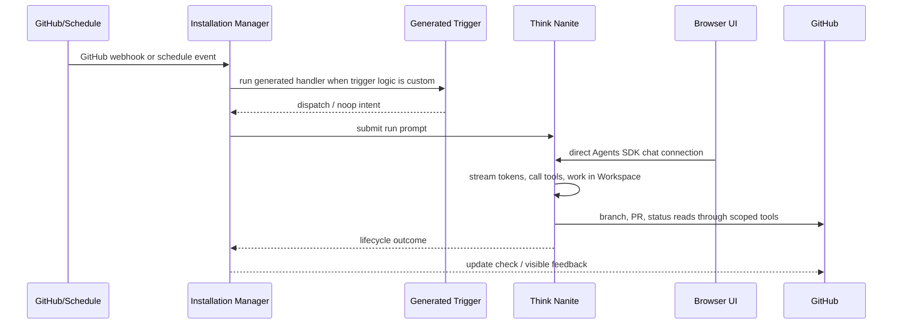

# Nanites docs

Nanites are small durable agents that own one vertical maintenance responsibility inside a GitHub installation.

The product bet is that modern coding agents are good enough to own narrow, recurring work when they have the right context, tools, and stop conditions. A Nanite is not a job queue item, a PR bot rule, or a generated runtime class. It is a durable collaborator with a name, a scope, a purpose, and Think-owned memory.

SigVelo is the programmable router around those collaborators. The installation manager receives external signals, generated trigger handlers decide what those signals mean, and stable Think Nanites do the actual work. This lets one installation have many tiny durable agents without turning every custom event rule into hand-written product code.

The core model should stay simple:

- an `Installation` is the GitHub App permission boundary and Nanite manager
- a `Nanite` owns one vertical responsibility across one or more repos
- a `Run` is one Nanite execution
- a `Run Outcome` is the lifecycle result of one Nanite Run
- a `Change Proposal` is the primary reviewable output when a Run changes code

Everything else is implementation detail unless it changes trust, timing, cost, or the user's next decision.

For the self-hosted bootstrap direction, see
[Zero-Config Self-Hosting Plan](./zero-config-self-hosting-plan.md) and
[Zero-Config Self-Hosting Edge Cases](./zero-config-self-hosting-edge-cases.md). The north star is
a Cloudflare-owned deploy plus setup flow where customers click through first-party Cloudflare and
GitHub screens without copying secrets or entering API keys.

## System map



There are three runtime planes:

- **Installation control plane**: auth, registry, routing, capability grants, GitHub feedback.
- **Nanite actor plane**: Think transcript, token stream, workspace, tool loop, lifecycle.
- **Inbound trigger plane**: generated code for machine-originated events that emits manager intents.

## Core loop



## Philosophy

### Keep GitHub data GitHub-shaped

Use Octokit and GitHub API shapes directly for GitHub-owned facts. SigVelo should not rename,
compress, or recreate GitHub data unless a real boundary requires it. See
[GitHub Shape Doctrine](./github-shape-doctrine.md).

### Keep Nanites small and numerous

A GitHub organization should be able to have many Nanites because each one is cheap, durable, and narrowly scoped. A docs repo might have one Nanite per package area. A frontend repo might have separate Nanites for smoke paths, accessibility regressions, and WebMCP instrumentation. The point is not one large autonomous agent. The point is many small maintainers that can be inspected, paused, redirected, or deleted independently.

This is what makes the router valuable. The event logic can be arbitrarily programmable, but the workers it wakes stay vertically sliced and legible.

### Let the Nanite own the work

The Nanite runtime should be a stable Think sub-agent. It owns the live transcript, token stream, current Run, workspace-backed investigation, Think memory, and lifecycle tools. The UI should connect to that sub-agent directly instead of reading copied transcript arrays or manager-owned chat history.

Manager state should stay small: registry, run summaries, routing decisions, GitHub feedback pointers, policy, and lossy runtime projections for roster UI. The detailed execution record belongs to Think.

### Generate triggers, not the Nanite runtime

Generated code is most valuable where rules are hard to parameterize: GitHub webhook predicates, cross-repo routing, custom schedule predicates, or noisy event dedupe.

That generated code should be a per-Nanite inbound trigger handler. It receives a normalized machine event, uses plain Worker-compatible TypeScript, and returns `dispatch` or `noop`. The installation manager validates and executes those intents.

The manifest `eventSource` is only a coarse candidate filter. It says which event families and
repositories may offer an event to a Nanite. It is not where interesting behavior lives. Once a
Nanite is a candidate, its root `triggerSource` TypeScript decides whether the event should actually
start a Run.

Schedules use the same generated trigger decision, but not an installation-wide dispatch shape. Cloudflare Agents
already provide durable schedules backed by Durable Object alarms, so a scheduled Nanite should have
a first-party Agent schedule owned by that Nanite sub-agent. The manager validates and installs the
schedule, but the recurring callback belongs to the Nanite path. The callback turns the tick into a
normalized machine event; the generated TypeScript trigger still decides `dispatchSelf` or `noop`.
Use Cloudflare Agent schedule language directly. Match the method names so the manifest maps to
`schedule()` / `scheduleEvery()` without a SigVelo-only schedule vocabulary:

```ts
type NaniteScheduledEventSource =
  | { type: "schedule"; when: string | number }
  | { type: "scheduleEvery"; intervalSeconds: number };
```

For `schedule.when`, use a number for delayed seconds, a cron string for recurring schedules, or an
ISO date string when the runtime should call `schedule(new Date(...))`.

Human prompts are different. Chat messages, manual run prompts, and operator steering go directly through the Think Nanite. They are not trigger events.

Trigger handlers are allowed to be clever. Nanites should stay focused. That split is the product architecture.

### Test the agent-to-agent loop

Generated trigger code needs a real acceptance loop because it is dynamic code that wakes another agent. The manager `testNaniteTrigger` callable owns that loop, and MCP exposes it through the explicit `sigvelo_test_nanite_trigger` tool.

It builds a realistic fixture event, runs the generated trigger, dispatches the real Think Nanite, waits for a lifecycle outcome, and returns structured `agentFeedback` from the Nanite to the coding agent that authored it. That proves three things at once:

- the generated trigger syntax and event handling work
- the trigger wakes the real model through the manager
- the Nanite sees the trigger payload and runtime scaffolding it needs

If the generated TypeScript trigger fails before dispatch, the test returns a trigger diagnostic to
the authoring agent instead of creating a failed Nanite Run. A Run Outcome only exists after the
Nanite is actually dispatched.

Production GitHub webhooks are slightly different for now. If a real GitHub webhook hits a broken
generated trigger, SigVelo records a failed Run labeled as "trigger failed before model dispatch" so
operators have a visible artifact to inspect. That failure does not create a GitHub check because no
model run started and there is no terminal check update to report.

### Prefer platform primitives over SigVelo-shaped layers

Use Cloudflare Agents, Think, Workspace, Worker Loader, Durable Object state, and SDK-native sub-agent routing directly where they already fit. Add SigVelo code when it owns product policy, auth, lifecycle boundaries, GitHub feedback, or generated-code validation.

Avoid compatibility shims, mirrored schemas, copied message arrays, custom live tunnels, old sandbox/container assumptions, or runtime wrappers that only rename first-party primitives.

### Keep the definition thin

A Nanite definition should mostly describe:

- scope: repos, files, packages, docs, or surfaces it owns
- soul: what it is trying to preserve and how it should make tradeoffs
- stop conditions: what counts as done, no-change, failed, or waiting for a human

Capabilities should come from repo-local instructions, MCP servers, skills, Workspace/git tools, and runtime-owned lifecycle commands. Do not grow a giant SigVelo-specific tool manifest unless a real authorization boundary requires it.

### GitHub is the first vertical, not the whole ontology

The first product should stay GitHub-shaped because it gives users a clear mental model: install the app, create Nanites, let them maintain repo surfaces, review their change proposals.

Within that GitHub-first path, keep authority scoped. Generated trigger handlers can read and
interpret events with scoped Octokit when useful. The Nanite Think agent does the work. The manager
owns policy and GitHub feedback. GitHub remains the artifact and CI truth surface.

## What Gets Authored

Nanite creation authors a thin manifest and generated trigger source for machine-originated event
sources. The manifest describes identity, model policy, coarse event intake, and repository/token
permission scope. The generated trigger source handles machine-originated behavior.

Do not give the authoring model a manager name, MCP tier, tool allowlist, factory topology, or
cross-Nanite routing plan. The active installation already selects the manager. GitHub MCP tools are
derived from `permissions.github.appPermissions`. Package-specific routing, release handling,
path filters, debounce rules, and other behavior belong in `triggerSource` code.

```ts
{
  manifest: {
    id: "docs-syncer-react-webmcp",
    name: "React WebMCP docs syncer",
    description: "Keeps React WebMCP docs aligned with package changes.",
    model: "@cf/zai-org/glm-4.7-flash",
    eventSource: {
      type: "github",
      events: ["push"],
      repositories: ["WebMCP-org/npm-packages"],
      branches: ["main"],
    },
    permissions: {
      github: {
        repositories: ["WebMCP-org/npm-packages", "WebMCP-org/docs"],
        appPermissions: {
          contents: "write",
          pull_requests: "write",
          actions: "read",
        },
      },
    },
    triggerSource: "...",
  },
}
```

The `eventSource` block above is just the candidate filter. The root `triggerSource` block owns the
package-specific decision. The `permissions.github` block is the token boundary for the Nanite's
workspace git operations and derived GitHub MCP PR/status tools; it is not a separate behavior
language.

Generated trigger code is ordinary Worker-compatible TypeScript. It routes events; it does not own
the Nanite runtime. Prefer the virtual `@sigvelo/nanite-trigger` authoring package for the
Octokit-shaped authoring contract and typed manager intents. Current validation catches static,
bundle, load, and runtime contract errors; deep Octokit semantic diagnostics may be skipped until a
dedicated validation Worker owns that typecheck path.

```ts
import { defineGitHubTrigger } from "@sigvelo/nanite-trigger";

export default defineGitHubTrigger({
  event: "push",
  async handle(event, ctx) {
    const changed = event.payload.commits.flatMap((commit) => [
      ...(commit.added ?? []),
      ...(commit.modified ?? []),
      ...(commit.removed ?? []),
    ]);
    const relevantFiles = changed.filter((file) => file.startsWith("packages/react-webmcp/"));

    if (relevantFiles.length === 0) {
      return ctx.noop("No React WebMCP package docs need syncing.");
    }

    return ctx.dispatchSelf({
      sourceRepo: event.payload.repository.full_name,
      packageName: "react-webmcp",
      before: event.payload.before,
      after: event.payload.after,
      files: relevantFiles,
    });
  },
});
```

Human prompts do not go through this trigger handler. They go directly to the Think Nanite through
chat or the explicit MCP start/test tools.

## What the Nanite receives

The stable Think Nanite gets a Run prompt, direct Workspace tools, GitHub-aware git auth, optional
GitHub MCP tools exposed inside the execute sandbox as `github.*`, and lifecycle tools.

```text
Use Workspace git tools for repository changes and branch pushes.
Use github.* tools inside execute for PR lookup, PR creation/update, and workflow/check reads.
Never push directly to a default branch.
When stacked PRs are useful:
- the bottom branch targets the repo default branch
- each higher branch targets the branch below it
- each PR is small and independently reviewable
- complete.outputUrl points at the best review entrypoint
When finished, call exactly one lifecycle tool.
```

The manager does not publish a hidden support lane for the Nanite. The Nanite chooses whether to
reuse an existing PR, open a new PR, create a simple PR stack, report no change, fail, or ask for a
human. For now, a stack is represented by the best review URL plus summary text rather than a
first-class SigVelo stack model.

## Source of truth

| Concern                                      | Owner                     | Notes                                                    |
| -------------------------------------------- | ------------------------- | -------------------------------------------------------- |
| Registry, policy, routing, run summaries     | Installation manager      | Small durable state plus lossy runtime projections only. |
| Transcript, streaming, tool turns, workspace | Think Nanite              | UI connects directly with Agents SDK hooks.              |
| GitHub webhook or schedule predicates        | Generated trigger handler | Emits intents; manager validates and executes.           |
| Repo edits and git operations                | Workspace + Shell git     | Uses scoped GitHub installation auth.                    |
| PR/search/status operations                  | GitHub MCP via codemode   | `github.*` in execute; Nanite-scoped tool inventory.     |
| Build, typecheck, test truth                 | GitHub CI                 | Prefer CI signals over a SigVelo process harness.        |
| Final outcome                                | Lifecycle tools           | `complete`, `no_change`, `fail`, `ask_human`.            |

## Future path

The old HLD/LLD explored a more aggressive generated-owner model where the model authored a
generated `Nanite extends Think` class. That remains a useful future idea, especially if Cloudflare
primitives make generated Durable Object facets cleaner.

The current product path is intentionally smaller:

```text
generated trigger handler -> stable Think Nanite -> workspace/git/GitHub tools -> lifecycle outcome
```

Do not build code around the generated-owner future until the stable path stops being enough.

## Active documents

This directory has seven active documents.

- `architecture.md` - long-term product model and durable boundaries
- `execution-architecture.md` - current runtime shape, centered on Think sub-agents and Workspace
- `nanite-model-config-plan.md` - MCP/manager-authored model selection for Nanite manifests
- `observability-plan.md` - cost, audit, telemetry, and dashboard planning for Nanites
- `tool-surface-lld.md` - low-level design for shared MCP/browser/manager-chat Nanite tools
- `roadmap.md` - the next few sprints, current milestone, and explicit non-goals
- `user-stories.md` - product-facing scenarios and prioritization language

Use them in that order.

## Concept artifact

`dynamic-nanites-concept.html` is a human-facing concept explainer. Runtime truth belongs in
`architecture.md` and `execution-architecture.md`.

## References

`references/` holds source-backed notes and local source indexes. It is not authoritative product direction.

Use `references/source-index.md` when you need first-party docs, `opensrc/` locations, or implementation reading order.

Use `references/github-mcp-capability-assignment.md` when changing GitHub MCP attachment,
Nanite-scoped GitHub tools, installation-token handling, or PR/stacked-PR capability.

## Maintenance rule

Do not let this directory turn back into a stack of overlapping plans.

- Product truth belongs in `architecture.md`.
- Build-now runtime truth belongs in `execution-architecture.md`.
- Future Nanite model-selection implementation detail belongs in `nanite-model-config-plan.md`.
- Observability and reporting planning belongs in `observability-plan.md`.
- Shared manager tool-surface implementation detail belongs in `tool-surface-lld.md`.
- Near-term sequencing belongs in `roadmap.md`.
- Product language and scenario framing belongs in `user-stories.md`.
- Research notes belong in `references/`.
