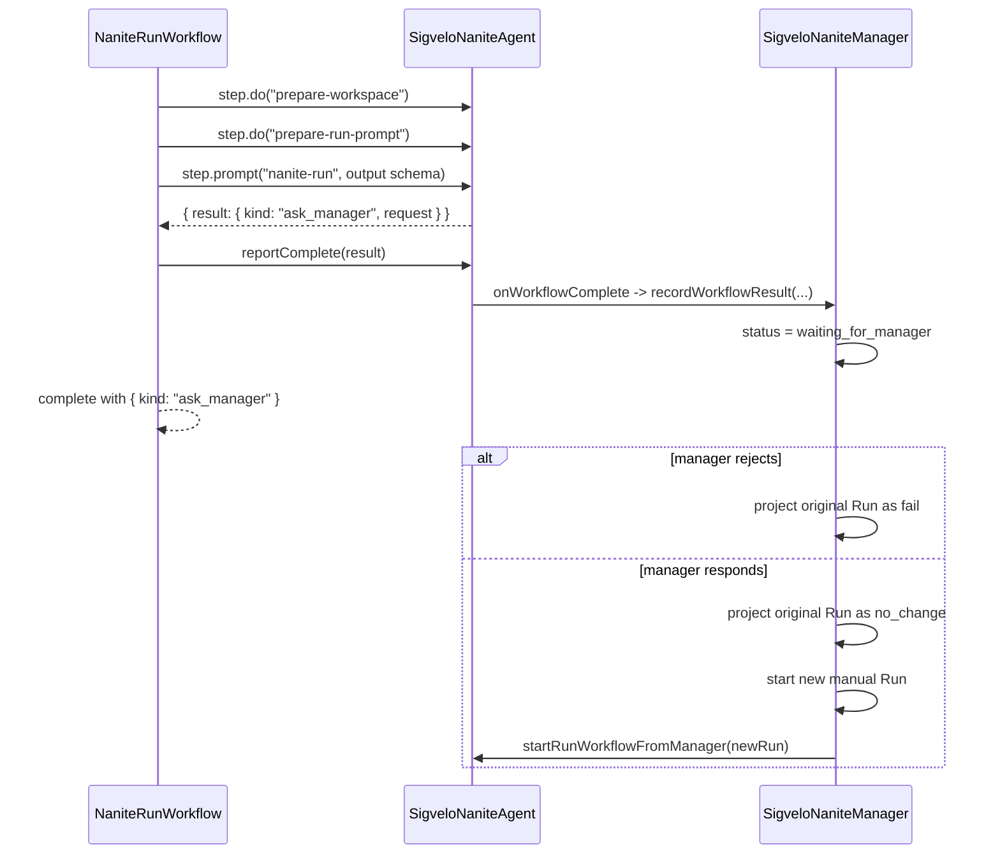

# Manager Requests In Workflow-Backed Runs

> Status: implemented runtime contract.
>
> This document explains the Nanite `ask_manager` path after Runs move to
> `ThinkWorkflow`. The durable Run design lives in
> `docs/architecture/references/workflow-backed-nanite-runs.md`.

## Direction

`ask_manager` is no longer a model-facing lifecycle tool or a Workflow pause. It is one branch of
the structured output returned by `NaniteRunWorkflow`:

```ts
type NaniteRunWorkflowResult =
  | {
      kind: "complete";
      summary: string;
      outputUrl: string | null;
      agentFeedback: NaniteAgentFeedback | null;
    }
  | { kind: "no_change"; summary: string; agentFeedback: NaniteAgentFeedback | null }
  | { kind: "fail"; summary: string; agentFeedback: NaniteAgentFeedback | null }
  | { kind: "ask_manager"; request: string };
```

When the Workflow receives `{ kind: "ask_manager" }`, it reports and returns that result. The Agents
SDK invokes the Nanite Workflow callback, and the Nanite projects the Manager request through the
Manager. The Workflow does not wait for an approval event and it does not prompt the same Nanite
again.

If the Manager later answers the request, the answer starts a new normal Run. That Run gets a new
Workflow instance, a new `runId`, and a manual trigger message containing the Manager's response and
the original Nanite request.

## Why

The old shape made `ask_manager` a lifecycle tool and stored resumption logic in
`SigveloNaniteManager`. That solved the first product problem, but it kept the fragile part in our
code: a Manager-owned prompt loop that had to resume a Nanite manually with `submitMessages`.

`ThinkWorkflow.step.prompt()` gives us the better primitive for a single Run:

- Think submits the model turn idempotently.
- Think records terminal prompt output as a Workflow notification.
- Think drains that notification through an outbox and alarms until delivery succeeds.
- The Workflow returns exactly one Run output.

Manager interaction should remain product orchestration, not hidden execution state inside the
Workflow. A follow-up Manager answer is a new unit of work, so it should be a new Run.

## Runtime Flow



## Request Contract

Keep the request narrow:

```ts
type ManagerRequest = {
  id: string;
  request: string;
  createdAt: string;
};
```

Do not add speculative fields such as `summary`, `requestedScopes`, UI routing, parent run links, or
manifest patch instructions until a concrete Manager UI needs them.

## Decision Contract

`resolveManagerRequest()` validates the current waiting projection and then does one of two things:

- `reject`: records a normal terminal `fail` outcome on the original Run.
- `resume`: records the original request Run as `no_change`, then starts a new manual Run with the
  Manager's answer.

It must not call the Nanite's `submitMessages()` path. It also must not call the Agents SDK
`approveWorkflow()` or `rejectWorkflow()` helpers for this flow, because the Workflow that produced
`ask_manager` has already completed.

## Ownership

Manager owns:

- validating the Run and request id
- recording `waiting_for_manager`
- displaying the request to the user/operator
- rejecting the original request or starting the follow-up Run
- recording product projection, audit, and observability facts

Workflow owns:

- the durable parent Run prompt
- returning exactly one structured output through `reportComplete()`
- surfacing unhandled setup or prompt failures through the Agents SDK Workflow error callback

Nanite owns:

- the transcript, tools, workspace, memory, and child Nanite behavior
- `onWorkflowComplete()` / `onWorkflowError()` projection through the Manager

## Non-Goals

- No app-local approval inbox.
- No SDK approval event for Manager requests.
- No SDK `needsApproval` or MCP elicitation path for this slice.
- No automatic GitHub App permission reapproval.
- No self-granting Nanites.
- No generated Dynamic Workflow source.
- No `submitMessages()`-based manager resume path.
- No parent/child Run chain metadata until the UI needs it.

## Checks

- `ask_manager` is emitted as structured Workflow output, not as a model-facing tool.
- Run projection moves to `waiting_for_manager` with a request-only `ManagerRequest`.
- Workflow reports the structured result; Nanite callback records the Manager request projection.
- Manager rejection produces a terminal `fail` projection without resuming the Workflow.
- Manager response starts a new Workflow-backed manual Run.
- Canceling a waiting Run cancels only the product projection and aborts active Think prompt work when
  any still exists; it does not need to terminate a completed Workflow.

## Sources

Checked June 20, 2026.

- Think Workflows guide: <https://developers.cloudflare.com/agents/harnesses/think/workflows/>
- Agents Workflows guide: <https://developers.cloudflare.com/agents/runtime/execution/run-workflows/>
- Think Workflow implementation:
  <https://github.com/cloudflare/agents/blob/main/packages/think/src/workflows.ts>
- Think Workflow notification delivery:
  <https://github.com/cloudflare/agents/blob/main/packages/think/src/think.ts>
