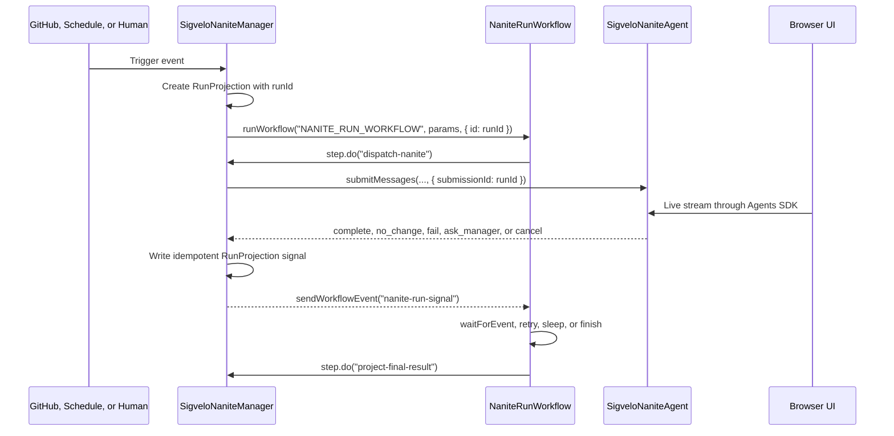

# Workflow-Backed Nanite Runs

> Status: target architecture for Nanite Run durability.
>
> This is the implementation guide for aligning Nanite Runs with Cloudflare Agents, Think, and
> Workflows primitives.

## Direction

Every user-facing Nanite Run should be backed by exactly one Cloudflare Workflow instance. The Run
id is the Workflow instance id.

That gives us one durable execution primitive instead of a manager-owned Run state machine plus a
separate workflow id. The product can keep saying "Run"; internally, the durable runtime object is
the Workflow instance.

Keep the current Think Nanite architecture. The Workflow starts the Nanite, waits for Nanite signals,
records named step status, retries deterministic side effects, and handles long waits. The Think
Nanite still owns the transcript, live stream, memory, workspace, tools, and sub-agent tree.

Do not use Dynamic Workflows in the first implementation. Dynamic Workflows are useful later when a
generated run plan needs to load Workflow code through Worker Loader. They are not needed to make a
normal Nanite Run durable.

## Why

The current Run model duplicates platform behavior. `SigveloNaniteManager` stores
`NaniteRunRecord`, owns allowed state transitions, dispatches the Think Nanite directly, and later
infers failure from stale manager state or a missing lifecycle tool call. That is fragile for the
case we care about: a long-running agent task that may wait on the manager, retry publication, or
resume after an isolate restart.

Cloudflare's own split matches the shape we need:

- Agents are for long-lived identity, real-time communication, state, and user interaction.
- Workflows are for durable execution, automatic retries, recovery, sleeps, and waiting for external
  events.
- `AgentWorkflow` bridges them so a Workflow can call back into its originating Agent and the Agent
  can send events back to the Workflow.

For Nanites, that means:

- The Manager remains the product authority and auth boundary.
- The Think Nanite remains the worker.
- The Run Workflow becomes the durable execution spine.
- The Manager keeps a Run projection, not a second execution state machine.

This deletes more than it adds. We should not build a custom `WorkflowRun` Durable Object,
`RunManager`, `WorkflowTaskAgent`, or `runId -> workflowId` mapping table.

## Vocabulary

Use these terms consistently:

| Term               | Meaning                                                                                           |
| ------------------ | ------------------------------------------------------------------------------------------------- |
| `Nanite`           | A stable Think Agent with identity, memory, tools, transcript, and workspace.                     |
| `Manager`          | The installation Agent that owns auth, registry, trigger intake, policy, and product projections. |
| `Run`              | The product/API noun for one Nanite execution. Implemented by one Cloudflare Workflow instance.   |
| `Run Workflow`     | The Cloudflare Workflow class that backs a Run.                                                   |
| `RunProjection`    | Manager/D1 summary keyed by `runId`, used for history, filters, audit, cost, and UI.              |
| `Think submission` | A lower-level attempt inside a Run, not a Run.                                                    |
| `Trigger Worker`   | Generated Worker Loader code that decides `dispatch` or `noop`.                                   |
| `Dynamic Workflow` | Later mechanism for loading generated Workflow source. Not a first-slice primitive.               |

Product language can keep `Run`. Runtime docs and code should avoid inventing another product noun
called `Workflow`.

## Target Flow



The important boundary is that the Nanite does the work and the Workflow coordinates the durable
process around that work.

## Cloudflare Constraints

These are the platform facts the implementation should follow.

### Workflows

Cloudflare Workflows define a `WorkflowEntrypoint` with a `run(event, step)` method. `step.do`
persists serializable step results, `step.sleep` and `step.sleepUntil` persist waits, and
`step.waitForEvent` waits for an event sent to a Workflow instance.

Create Workflow instances with a caller-provided id:

```ts
await env.MY_WORKFLOW.create({
  id: runId,
  params,
});
```

`waitForEvent` event types may contain letters, digits, `_`, and `-`; do not use dotted event names.
Use `nanite-run-signal`, not `nanite.run.signal`. The default wait timeout is 24 hours; set explicit
timeouts for Nanite waits.

Workflow event payloads are immutable. Store durable state by returning values from `step.do` or by
writing the Manager projection from a durable step.

### Agents and Workflows

Use `AgentWorkflow` from `agents/workflows`, not a raw `WorkflowEntrypoint`, for the Run Workflow.
The Agents SDK already provides:

- `Agent.runWorkflow(workflowName, params, options)`
- `Agent.sendWorkflowEvent(workflowName, instanceId, event)`
- Workflow status helpers
- durable `step.reportComplete`, `step.reportError`, `step.updateAgentState`,
  `step.mergeAgentState`, and `step.resetAgentState`

Non-durable callbacks can repeat on retry. Do not use non-durable broadcasts as Run truth.

### Think Workflows

`ThinkWorkflow.step.prompt()` is for a Workflow-owned process that needs a durable structured Think
turn. It is not the foundation for the first Nanite Run migration.

Use it later for narrow structured steps, such as triage or plan synthesis, when the Workflow owns
the process and typed output matters more than live streaming. Keep normal Nanite work on
`SigveloNaniteAgent.submitMessages()` so the existing transcript, workspace, tools, and UI stream
remain intact.

### Dynamic Workflows

Dynamic Workflows combine a Worker Loader binding with a Workflow binding. `wrapWorkflowBinding`
tags created Workflow instances with routing metadata. `createDynamicWorkflowEntrypoint` reloads the
right Dynamic Worker when the Workflow resumes.

Use this only when generated or tenant-authored code must define the Workflow steps. Metadata passed
to `wrapWorkflowBinding` is persisted and readable through Workflow status, so it must contain only
routing keys such as `installationId`, `workflowSourceId`, and `versionId`. Do not put tokens,
secrets, prompts, repository content, or user data in it.

## Ownership

### Manager

`SigveloNaniteManager` keeps:

- Nanite registry and manifest versions
- GitHub installation and product authorization
- trigger intake and trigger dedupe
- `RunProjection` writes and queries
- audit, cost, and observability facts
- the bridge from Nanite lifecycle tools to Workflow events

The Manager should stop owning:

- the execution state machine for active Runs
- retry and stale-run recovery that Workflows can express directly
- a separate workflow identity layer
- ad hoc waiting states such as `waiting_for_manager` as execution truth

### Think Nanite

`SigveloNaniteAgent` keeps:

- Think memory and transcript
- live UI streaming
- Workspace and git operations
- GitHub MCP and code tools
- sub-agent and sub-sub-agent behavior
- lifecycle tools: `complete`, `no_change`, `fail`, `ask_manager`

Lifecycle tools become signals into the Run Workflow. They no longer make Manager state the source
of execution truth.

### Run Workflow

`NaniteRunWorkflow` owns:

- durable dispatch to the Think Nanite
- waiting for Nanite signals
- waiting for manager decisions
- retry around deterministic side effects
- final result reporting
- named step status for debugging

It must not own:

- product authorization decisions
- raw secrets
- full transcripts
- direct GitHub installation credentials
- arbitrary generated authority that bypasses the Manager

## Run Projection

Keep one projection keyed by `runId`. It is the product index, not the runtime owner.

```ts
type RunProjection = {
  runId: string; // Cloudflare Workflow instance id
  workflowName: "NANITE_RUN_WORKFLOW";
  naniteId: string;
  triggerKey: string;
  triggerType: "manual" | "github" | "schedule";
  actor: ObservabilityActor | null;
  model: NaniteRunModelSnapshot;
  status: "active" | "waiting" | "complete" | "failed" | "canceled";
  outcome: "complete" | "no_change" | "fail" | "canceled" | null;
  waitingOn: "manager" | "external_event" | null;
  summary: string | null;
  outputUrl: string | null;
  agentFeedback: string | null;
  startedAt: string;
  updatedAt: string;
  completedAt: string | null;
};
```

The UI can render this projection. Detailed execution status should come from Workflow status and
step logs when the user opens a Run detail view.

## Workflow Signals

Use one Workflow event type for Nanite-to-Workflow signals:

```ts
const NANITE_RUN_SIGNAL_EVENT = "nanite-run-signal";

type NaniteRunSignal =
  | {
      kind: "outcome";
      signalId: string;
      runId: string;
      outcome: "complete" | "no_change" | "fail";
      summary: string;
      outputUrl: string | null;
      agentFeedback: string | null;
    }
  | {
      kind: "manager_request";
      signalId: string;
      runId: string;
      requestId: string;
      request: string;
    }
  | {
      kind: "canceled";
      signalId: string;
      runId: string;
      reason: string;
    };
```

Use a separate event type for manager decisions:

```ts
const MANAGER_DECISION_EVENT = "manager-decision";
```

Both names satisfy Cloudflare's event type constraints.

Write the projection before sending the Workflow event. Include a unique `signalId` for each signal.
That makes delivery idempotent and gives the Workflow a fallback if the Nanite produces a signal
before the Workflow starts waiting.

## First Implementation

### 1. Add the binding

Add a Workflow binding to `wrangler.jsonc`:

```jsonc
"workflows": [
  {
    "name": "nanite-run-workflow",
    "binding": "NANITE_RUN_WORKFLOW",
    "class_name": "NaniteRunWorkflow",
  },
],
```

Then regenerate Worker binding types:

```sh
vp exec wrangler types env.d.ts --include-runtime false --strict-vars false --config wrangler.jsonc
```

Do not add `@cloudflare/dynamic-workflows` for this slice.

### 2. Add `NaniteRunWorkflow`

Add a static Workflow class:

```ts
import { AgentWorkflow } from "agents/workflows";

import type { AgentWorkflowEvent, AgentWorkflowStep } from "agents/workflows";
import type { SigveloNaniteManager } from "#/backend/agents/SigveloNaniteManager";

export type NaniteRunWorkflowParams = {
  runId: string;
  naniteId: string;
};

export class NaniteRunWorkflow extends AgentWorkflow<
  SigveloNaniteManager,
  NaniteRunWorkflowParams
> {
  async run(
    event: AgentWorkflowEvent<NaniteRunWorkflowParams>,
    step: AgentWorkflowStep,
  ): Promise<NaniteRunSignal> {
    const { runId } = event.payload;

    await step.do("dispatch-nanite", async () => {
      await this.agent.dispatchRunToThinkAgent({ runId });
    });

    let afterSignalId: string | null = null;

    while (true) {
      const existing = await step.do("read-existing-run-signal", async () => {
        return this.agent.getRunSignal({ runId, afterSignalId });
      });

      const signal =
        existing ??
        (
          await step.waitForEvent<NaniteRunSignal>("wait-for-nanite-signal", {
            type: NANITE_RUN_SIGNAL_EVENT,
            timeout: "7 days",
          })
        ).payload;

      afterSignalId = signal.signalId;

      if (signal.kind === "manager_request") {
        await step.do("project-manager-wait", async () => {
          await this.agent.projectRunWaitingForManager(signal);
        });

        const decision = await step.waitForEvent("wait-for-manager-decision", {
          type: MANAGER_DECISION_EVENT,
          timeout: "7 days",
        });

        await step.do("resume-after-manager-decision", async () => {
          await this.agent.resumeRunAfterManagerDecision({
            runId,
            decision: decision.payload,
          });
        });

        continue;
      }

      await step.do("project-final-run-result", async () => {
        await this.agent.projectFinalRunSignal(signal);
      });

      await step.reportComplete(signal);
      return signal;
    }
  }
}
```

### 3. Move Manager dispatch behind the Workflow

Change the Manager path from:

```ts
await this.dispatchRun({ runId });
```

to:

```ts
await this.runWorkflow(
  "NANITE_RUN_WORKFLOW",
  { runId: run.runId, naniteId: run.naniteId },
  {
    id: run.runId,
    metadata: {
      naniteId: run.naniteId,
      triggerType: run.trigger.type,
    },
  },
);
```

Move the current direct sub-agent dispatch body into `dispatchRunToThinkAgent({ runId })`:

```ts
const run = this.requireRunProjection(input.runId);
const nanite = this.requireNanite(run.naniteId);
const agent = await this.subAgent(SigveloNaniteAgent, run.naniteId);

await agent.enqueueFromManager({ managerName: this.name, nanite, run });
```

Keep `submissionId: run.runId` and the existing trigger idempotency key when calling
`submitMessages`. A Think submission is the attempt under the Run, not the Run itself.

### 4. Replace lifecycle state writes with signals

`complete`, `no_change`, `fail`, `ask_manager`, and cancel should call the Manager. The Manager
should:

1. validate that the Nanite owns the Run
2. write or update the `RunProjection` idempotently
3. record audit and cost facts
4. send `NANITE_RUN_SIGNAL_EVENT` to the Run Workflow instance
5. return the projection to the Nanite

Example:

```ts
await this.projectFinalRunSignal(signal);

await this.sendWorkflowEvent("NANITE_RUN_WORKFLOW", signal.runId, {
  type: NANITE_RUN_SIGNAL_EVENT,
  payload: signal,
});
```

If `sendWorkflowEvent` fails transiently after the projection write, retry the send. If it still
fails, leave the projection signal available for `read-existing-run-signal`.

### 5. Model `ask_manager` as a wait

`ask_manager` should not be a terminal Run state. It should write `status: "waiting"` and
`waitingOn: "manager"` to the projection, then send a `manager_request` signal to the Workflow.
The tool input stays `{ request: string }`; the manager wraps it with run id, request id, and
timestamps. The detailed request contract lives in `../ask-manager-escalation-plan.md`.

The Workflow waits for `MANAGER_DECISION_EVENT`. After the Manager decision arrives, the Workflow
durably resumes the Think Nanite with the decision. If the timeout expires, the Workflow should
project a failed outcome with a timeout reason.

### 6. Keep cancellation explicit

Cancel should terminate or signal the Workflow, then abort the active Think submission if one exists.
Projection status becomes `canceled`.

The Manager can expose product commands such as cancel, pause, resume, and retry by calling the
Agents SDK Workflow helpers. The UI should not mutate projection state directly.

### 7. Remove the old state machine

Once the Workflow-backed path passes integration tests, remove these as execution owners:

- `allowedRunStatusTransitions`
- manager-owned active Run lifecycle transitions
- stale active-run repair that Workflows now cover
- any future custom `WorkflowRun` Durable Object design

Keep compatibility only where an existing UI query needs a projection. The app is pre-prod, so do
not build a long-lived migration layer.

### 8. Clean up bespoke runtime surface

Treat cleanup as part of the Workflow-backed Run migration, not a follow-up project. Remove or
tighten these surfaces as the new primitive lands:

- remove optional per-run Workflow identity fields; `runId` is the Workflow instance id and
  `NANITE_RUN_WORKFLOW` is a constant
- collapse `complete`, `no_change`, `fail`, `ask_manager`, and cancel onto one signal-writing path
- keep manual, scheduled, and trigger-created Runs on the same Workflow start path after dedupe
- keep Dynamic Workflows out of `package.json`, `wrangler.jsonc`, and generated types until
  generated Workflow source exists
- treat Think submissions as attempts and expose them only in debugging views, not as product Runs
- keep Workflow event names and payloads behind named constants and named signal types
- run Fallow after the cutover to find now-unused files, exports, types, dependencies, and stale
  suppressions

Do not make renaming `NaniteRunRecord` a required migration step. The important cleanup is semantic:
Manager-held Run data becomes a projection, whatever the local type is called during the cutover.

## UI and Observability

The Run list should read `RunProjection`. The Run detail should combine:

- projection summary and outcome
- Workflow status and step logs
- Think transcript link or live stream
- Think submission attempts for debugging
- audit and cost facts

If Workflow status and projection disagree, show the Workflow as execution truth and the projection
as the last indexed product fact. Add a repair action that refreshes projection from Workflow status
instead of letting the UI choose between two truths.

## Dynamic Workflows Later

Add Dynamic Workflows only after the static Run Workflow is working and we have a real need for
generated Workflow source.

The later shape should be:

1. store generated Workflow source by `{ workflowSourceId, versionId }`
2. keep the source available for the full Workflow retention window
3. wrap the Workflow binding with routing metadata only
4. load the source through Worker Loader on every resume
5. expose only a narrow Manager API to generated code
6. statically validate generated source before it can run

Generated trigger handlers should remain Trigger Workers. They decide whether to dispatch a Run.
They should not become Dynamic Workflows just because Dynamic Workflows exist.

## Checks

The first implementation is complete when these checks pass:

- manual Run creates a Workflow with `instance.id === runId`
- trigger dedupe returns the existing Run projection and does not create a second Workflow
- lifecycle `complete`, `no_change`, and `fail` write one projection result and unblock the Workflow
- `ask_manager` makes the Workflow wait and then resume after a manager decision
- a Nanite signal written before `waitForEvent` is still observed through `read-existing-run-signal`
- cancel terminates the Workflow and aborts active Think work
- Run list reads projections
- Run detail can show Workflow step status
- `vp exec wrangler types env.d.ts --include-runtime false --strict-vars false --config wrangler.jsonc`
  runs after binding changes
- `vp check` and `vp test` pass

## First-Party Sources

Checked June 20, 2026.

Cloudflare docs:

- Cloudflare Workflows overview: <https://developers.cloudflare.com/workflows/>
- Workflows Workers API: <https://developers.cloudflare.com/workflows/build/workers-api/>
- Workflows events and parameters:
  <https://developers.cloudflare.com/workflows/build/events-and-parameters/>
- Agents with Workflows concept guide: <https://developers.cloudflare.com/agents/concepts/workflows/>
- Agents `runWorkflow` guide:
  <https://developers.cloudflare.com/agents/runtime/execution/run-workflows/>
- Think Workflows guide: <https://developers.cloudflare.com/agents/harnesses/think/workflows/>
- Dynamic Workflows guide:
  <https://developers.cloudflare.com/dynamic-workers/usage/dynamic-workflows/>
- Dynamic Workers guide: <https://developers.cloudflare.com/dynamic-workers/>

Cloudflare source:

- Agents repository: <https://github.com/cloudflare/agents>
- `Agent.runWorkflow`, `sendWorkflowEvent`, and Workflow helpers:
  <https://github.com/cloudflare/agents/blob/1e571a507811612f0805b60d15c2776f65ee2ed4/packages/agents/src/index.ts>
- `AgentWorkflow` implementation:
  <https://github.com/cloudflare/agents/blob/1e571a507811612f0805b60d15c2776f65ee2ed4/packages/agents/src/workflows.ts>
- Think Workflow implementation:
  <https://github.com/cloudflare/agents/blob/1e571a507811612f0805b60d15c2776f65ee2ed4/packages/think/src/workflows.ts>
- Think workflow notification delivery:
  <https://github.com/cloudflare/agents/blob/1e571a507811612f0805b60d15c2776f65ee2ed4/packages/think/src/think.ts>
- Dynamic Workflows repository: <https://github.com/cloudflare/dynamic-workflows>
- Dynamic Workflow binding wrapper:
  <https://github.com/cloudflare/dynamic-workflows/blob/9726985af886698e85e90e3f044daf6dfcea2c1d/packages/dynamic-workflows/src/binding.ts>
- Dynamic Workflow entrypoint:
  <https://github.com/cloudflare/dynamic-workflows/blob/9726985af886698e85e90e3f044daf6dfcea2c1d/packages/dynamic-workflows/src/entrypoint.ts>

Local Nanites baseline:

- `src/backend/agents/SigveloNaniteManager.ts`
- `src/backend/agents/SigveloNaniteAgent.ts`
- `wrangler.jsonc`
- `docs/architecture/execution-architecture.md`
- `docs/architecture/ask-manager-escalation-plan.md`
- `docs/architecture/nanite-workflows-design.md`
