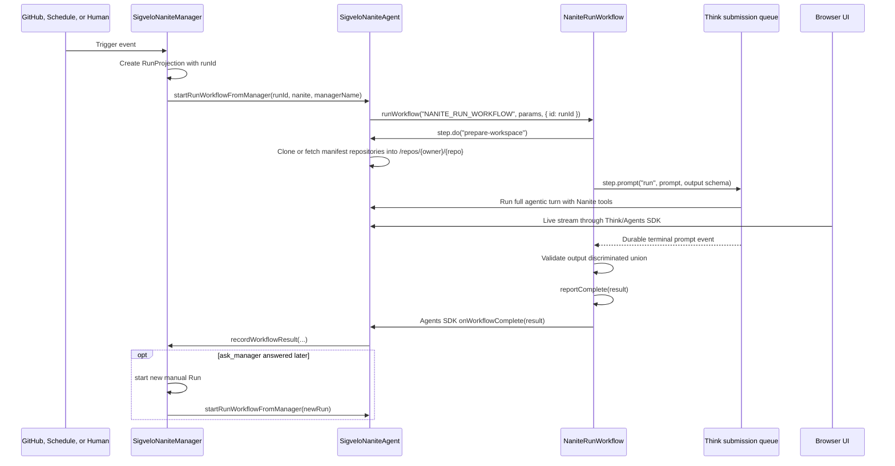

# Workflow-Backed Nanite Runs

> Status: implemented runtime contract.
>
> This is the implementation guide for aligning Nanite Runs with Cloudflare Agents, Think, and
> Workflows primitives.

## Direction

Every user-facing Nanite Run is one Cloudflare Workflow instance. The Run id is the Workflow
instance id.

The Run Workflow extends `ThinkWorkflow`, not plain `AgentWorkflow`. The Workflow owns one durable
parent Run prompt with `step.prompt()`. Think still owns the Nanite transcript, workspace, memory,
tools, streaming, and child Nanite behavior. The Manager keeps auth, trigger intake, dedupe, and the
product projection.

The bespoke lifecycle harness is gone:

- remove model-facing `complete`, `no_change`, `fail`, and `ask_manager` lifecycle tools
- remove manager-driven `submitMessages()` dispatch for Runs
- remove lifecycle continuation prompts and stale active-run repair as execution ownership
- remove a separate `runId -> workflowId` layer
- treat Think submissions as Workflow-owned attempts, not product Runs

Dynamic Workflows are not part of this runtime. They become relevant when generated or
tenant-authored Workflow source must be loaded through Worker Loader. Our first durability problem is
not generated workflow code; it is making a normal Nanite Run durable by putting the parent run loop
inside Cloudflare Workflows.

## Why

The old Run model duplicated platform behavior. `SigveloNaniteManager` created a
`NaniteRunRecord`, dispatches a Think submission directly, waits for model-facing lifecycle tools,
tries to repair completed submissions that never called a lifecycle tool, and stores manager wait
state as execution truth. That is exactly the kind of lifecycle harness Cloudflare Workflows and
Think Workflows are meant to own.

Cloudflare's split matches our domain:

- Agents are durable identities with state, RPC, real-time client connection, tools, transcripts,
  memory, and workspace.
- Workflows are durable executions with named steps, retries, sleeps, and waits for external events.
- `ThinkWorkflow.step.prompt()` submits a Think turn, waits for its terminal Workflow event, validates
  typed output, and relies on Think's outbox/alarm delivery until the Workflow receives the result.

For Nanites, that means:

- Manager remains the product authority and auth boundary.
- Think Nanite remains the worker and tool host.
- Run Workflow becomes the execution spine.
- Run projection becomes an index for UI, audit, cost, and history, not a second state machine.

This should delete more code than it adds. We should not introduce `WorkflowRun`, `RunManager`,
`WorkflowTaskAgent`, lifecycle signal tables, or another product noun for one execution.

## First-Party Source Facts

These are the source-level constraints that drive the design.

`ThinkWorkflow` lives in `@cloudflare/think/workflows` and extends `AgentWorkflow`. Its
`step.prompt()` implementation:

- accepts a prompt string and a Zod object schema
- creates or finds an idempotent Think submission inside `step.do("<step>:submit")`
- stores Workflow metadata on the submission, including workflow name, workflow id, step name, event
  type, output schema, and prompt fingerprint
- waits with `step.waitForEvent("<step>:wait")`
- cancels the submission on timeout by default
- throws typed prompt errors for `aborted`, `skipped`, `error`, timeout, and schema validation
- validates the terminal output again with the original Zod schema before returning

Think implements structured Workflow output by injecting a reserved `think_final_answer` tool into
the turn. The model can use normal Nanite tools first, then calls the internal final-answer tool with
schema-shaped arguments. Think strips that internal tool call/result from persisted conversation and
stores a pending Workflow notification. Think drains the notification outbox with
`sendWorkflowEvent()` and Durable Object alarms until delivery succeeds.

`ThinkWorkflow` must be started from inside the Think Agent with `this.runWorkflow(...)`. Calling the
Workflow binding directly does not include the Agent identity that `AgentWorkflow` needs to reconnect
`this.agent` inside `run()`.

`step.prompt()` requires a Zod object schema. A discriminated union output is still fine, but it must
be wrapped in an object:

```ts
const naniteRunPromptOutputSchema = z.object({
  result: z.discriminatedUnion("kind", [
    z.object({
      kind: z.literal("complete"),
      summary: z.string().min(1),
      outputUrl: z.string().url().nullable(),
      agentFeedback: agentFeedbackSchema.nullable(),
    }),
    z.object({
      kind: z.literal("no_change"),
      summary: z.string().min(1),
      agentFeedback: agentFeedbackSchema.nullable(),
    }),
    z.object({
      kind: z.literal("fail"),
      summary: z.string().min(1),
      agentFeedback: agentFeedbackSchema.nullable(),
    }),
    z.object({
      kind: z.literal("ask_manager"),
      request: z.string().min(1),
    }),
  ]),
});
```

## Vocabulary

Use these terms consistently:

| Term               | Meaning                                                                                           |
| ------------------ | ------------------------------------------------------------------------------------------------- |
| `Nanite`           | A stable Think Agent with identity, memory, tools, transcript, workspace, and child Nanites.      |
| `Manager`          | The installation Agent that owns auth, registry, trigger intake, policy, and product projections. |
| `Run`              | The product/API noun for one Nanite execution. Implemented by one Workflow instance.              |
| `Run Workflow`     | The `ThinkWorkflow` class that backs a Run.                                                       |
| `RunProjection`    | Manager summary keyed by `runId`, used for history, filters, audit, cost, and UI.                 |
| `Think submission` | A Workflow prompt attempt inside a Run, not a Run.                                                |
| `Trigger Worker`   | Generated Worker Loader code that decides `dispatch` or `noop`.                                   |
| `Dynamic Workflow` | Later mechanism for loading generated Workflow source. Not a first-slice primitive.               |

Product language can keep `Run`. Runtime docs and code should avoid inventing another noun called
`WorkflowRun`.

## Target Flow



The Workflow coordinates the durable process. The Nanite does the work. The Manager indexes the
product facts.

## Ownership

### Manager

`SigveloNaniteManager` keeps:

- Nanite registry and manifest versions
- GitHub installation and product authorization
- trigger intake and trigger dedupe
- run projection writes and queries
- manager-request resolution commands
- audit, cost, and observability facts

The Manager stops owning:

- active Run execution
- lifecycle-tool interpretation
- lifecycle-outcome repair that Workflows express directly
- manager-driven resume via `submitMessages()`
- a separate workflow identity layer

### Think Nanite

`SigveloNaniteAgent` keeps:

- Think memory and transcript
- live UI streaming
- workspace and git operations
- GitHub MCP and code tools
- sub-agent and sub-sub-agent behavior
- SDK Workflow callbacks that project result/error facts through the Manager

The Nanite stops exposing lifecycle tools to the model. The structured output from
`ThinkWorkflow.step.prompt()` replaces `complete`, `no_change`, `fail`, and `ask_manager`.

### Run Workflow

`NaniteRunWorkflow` owns:

- durable prompt submission
- durable workspace preparation before the prompt
- typed output validation
- structured result reporting through `reportComplete()`
- named step status for debugging

It must not own:

- product authorization decisions
- raw secrets
- full transcripts
- direct GitHub installation credentials
- generated authority that bypasses the Manager

## Run Projection

Keep one projection keyed by `runId`. It is the product index, not the runtime owner.

```ts
type RunProjection = {
  runId: string; // Cloudflare Workflow instance id
  workflowName: "NANITE_RUN_WORKFLOW";
  naniteId: string;
  triggerKey: string;
  triggerType: "manual" | "github" | "schedule";
  actor: ObservabilityActor | null;
  model: NaniteRunModelSnapshot;
  status: "running" | "waiting_for_manager" | "complete" | "no_change" | "fail" | "canceled";
  summary: string | null;
  outputUrl: string | null;
  agentFeedback: NaniteAgentFeedback | null;
  managerRequest: ManagerRequest | null;
  startedAt: string;
  updatedAt: string;
  completedAt: string | null;
};
```

The UI can render this projection. Detailed execution status comes from Workflow status and step
logs when the user opens a Run detail view. If Workflow status and projection disagree, Workflow is
the execution truth and projection is the last indexed product fact.

## Manager Requests

`ask_manager` is no longer a model-facing tool. It is one member of the Workflow prompt output union.

When the output is `{ kind: "ask_manager" }`, the Workflow:

1. completes with `{ kind: "ask_manager" }`
2. lets the Nanite's `onWorkflowComplete()` callback project the Manager request

Manager-request resolution must not call `submitMessages()` directly. It also must not use
`approveWorkflow()` or `rejectWorkflow()` for this path, because the Workflow has already completed.
Rejecting the request records a normal terminal `fail` outcome on the original Run. Answering the
request starts a new manual Run with the manager response in the trigger message.

The current request shape should stay narrow: `request` only. Do not add `summary`,
`requestedScopes`, parent run links, or speculative product metadata until a real manager UI
requires it.

## Sub-Sub-Agent Architecture

This works with the current sub-agent and sub-sub-agent model. The Workflow wraps the parent Run; it
does not replace Think's tool system or the Nanite's ability to create/use child Nanites.

The boundary is:

- Workflow owns the durable parent Run prompt.
- Manager owns manager-request waits.
- Think Nanite owns the agentic turn and tool graph.
- Child Nanites remain tool-mediated work inside the parent prompt unless a future product feature
  requires each child task to be its own durable Run Workflow.

That gives us durability without making every internal delegation a product Run.

## Runtime Contract

### 1. Keep one static Workflow binding

Keep a static Workflow binding:

```jsonc
"workflows": [
  {
    "name": "nanite-run-workflow",
    "binding": "NANITE_RUN_WORKFLOW",
    "class_name": "NaniteRunWorkflow",
  },
],
```

Then regenerate Worker binding types:

```sh
vp exec wrangler types env.d.ts --include-runtime false --strict-vars false --config wrangler.jsonc
```

Do not add `@cloudflare/dynamic-workflows` for this slice.

### 2. `NaniteRunWorkflow` is a `ThinkWorkflow`

`NaniteRunWorkflow` extends `ThinkWorkflow<SigveloNaniteAgent, NaniteRunWorkflowParams>`.

The run loop is:

1. prepare the workspace from manifest-scoped repository permissions
2. prompt the Nanite for a structured result
3. complete the Workflow with the structured result
4. project the result from the Nanite's Workflow callback; manager responses start a new manual Run

### 3. Start the Workflow through the Nanite

Manager dispatch uses Nanite-owned Workflow start:

```ts
const agent = await this.subAgent(SigveloNaniteAgent, run.naniteId);
await agent.startRunWorkflowFromManager({
  managerName: this.name,
  nanite,
  run,
});
```

Inside `SigveloNaniteAgent.startRunWorkflowFromManager`, call:

```ts
await this.runWorkflow(
  "NANITE_RUN_WORKFLOW",
  { runId: run.runId, managerName: this.name },
  {
    id: run.runId,
    metadata: {
      naniteId: run.naniteId,
      triggerType: run.trigger.type,
    },
  },
);
```

This preserves the required Think Agent context for `ThinkWorkflow`.

### 4. Lifecycle tools are structured output

`complete`, `no_change`, `fail`, and `ask_manager` are not model-facing tools in `getTools()`. The
run prompt and system prompt tell the Nanite to finish by returning the requested structured result.
The internal `think_final_answer` tool is reserved Cloudflare Think plumbing and should not appear in
our product API.

There is no custom stop condition based on lifecycle tool calls. `ThinkWorkflow` stops the prompt
when the internal final-answer tool is called.

### 5. Project Workflow results from SDK callbacks

Do not add Workflow-only Nanite RPC shims. `NaniteRunWorkflow` should call `reportComplete(result)`
and return. `SigveloNaniteAgent.onWorkflowComplete()` projects the structured result to the Manager.
`SigveloNaniteAgent.onWorkflowError()` projects setup or prompt failures before structured output.

The Manager validates that the Run belongs to the Nanite before writing the projection.

### 6. Resolve manager requests by projecting or starting a Run

`SigveloNaniteManager.resolveManagerRequest()` should validate the current projection and then:

- record a terminal `fail` on rejection
- record the request Run as resolved and start a new manual Run on manager response

It should not call the Nanite's `submitMessages()` path, and it should not use SDK approval helpers
for this flow. The next prompt belongs to the new Run's Workflow.

### 7. Legacy lifecycle repair is absent

The runtime has no lifecycle continuation prompts, lifecycle watchdog scheduling, manager-driven
`resumeFromManager`, or stale active-run repair. `recordRunFailureWithoutWorkflowOutput()` is only
the error projection path for workflow-start failure, trigger failure, invalid callback output, or
`onWorkflowError()`.

Debug/maintenance APIs may inspect Think submissions or clear old SDK state. They do not decide Run
outcomes.

### 8. Keep Dynamic Workflows out

Do not add Dynamic Workflow dependencies, bindings, source ids, version ids, or routing metadata now.
Generated trigger handlers remain Trigger Workers: they decide whether to dispatch a Run. Generated
Workflow source is a later feature with a different problem statement.

## Checks

Runtime checks:

- manual Run creates a Workflow with `instance.id === runId`
- trigger dedupe returns the existing Run projection and does not create a second Workflow
- `complete`, `no_change`, and `fail` are structured Workflow outputs, not model-facing tools
- `ask_manager` is a structured Workflow output and completes the Workflow after projecting the
  Manager request
- manager rejection produces a terminal `fail` projection without resuming the Workflow
- manager response starts a new Workflow-backed manual Run
- cancellation aborts active Think prompt work when possible and does not need to terminate a
  completed Workflow
- Run list reads projections
- Run detail can show Workflow status and step status
- `vp exec wrangler types env.d.ts --include-runtime false --strict-vars false --config wrangler.jsonc`
  runs after binding changes
- `vp check` and `vp test` pass

## First-Party Sources

Checked June 20, 2026.

Cloudflare docs:

- Cloudflare Workflows overview: <https://developers.cloudflare.com/workflows/>
- Workflows Workers API: <https://developers.cloudflare.com/workflows/build/workers-api/>
- Workflows events and parameters:
  <https://developers.cloudflare.com/workflows/build/events-and-parameters/>
- Agents with Workflows concept guide: <https://developers.cloudflare.com/agents/concepts/workflows/>
- Agents `runWorkflow` guide:
  <https://developers.cloudflare.com/agents/runtime/execution/run-workflows/>
- Think Workflows guide: <https://developers.cloudflare.com/agents/harnesses/think/workflows/>
- Dynamic Workflows guide:
  <https://developers.cloudflare.com/dynamic-workers/usage/dynamic-workflows/>
- Dynamic Workers guide: <https://developers.cloudflare.com/dynamic-workers/>

Cloudflare source:

- Agents repository: <https://github.com/cloudflare/agents>
- `Agent.runWorkflow`, `sendWorkflowEvent`, and Workflow helpers:
  <https://github.com/cloudflare/agents/blob/main/packages/agents/src/index.ts>
- `AgentWorkflow` implementation:
  <https://github.com/cloudflare/agents/blob/main/packages/agents/src/workflows.ts>
- `ThinkWorkflow` implementation:
  <https://github.com/cloudflare/agents/blob/main/packages/think/src/workflows.ts>
- Think structured output and Workflow notification delivery:
  <https://github.com/cloudflare/agents/blob/main/packages/think/src/think.ts>
- Dynamic Workflows repository: <https://github.com/cloudflare/dynamic-workflows>

Local Nanites baseline:

- `src/backend/agents/SigveloNaniteManager.ts`
- `src/backend/agents/SigveloNaniteAgent.ts`
- `src/backend/agents/NaniteRunWorkflow.ts`
- `wrangler.jsonc`
- `docs/architecture/execution-architecture.md`
- `docs/architecture/ask-manager-escalation-plan.md`
- `docs/architecture/nanite-workflows-design.md`
