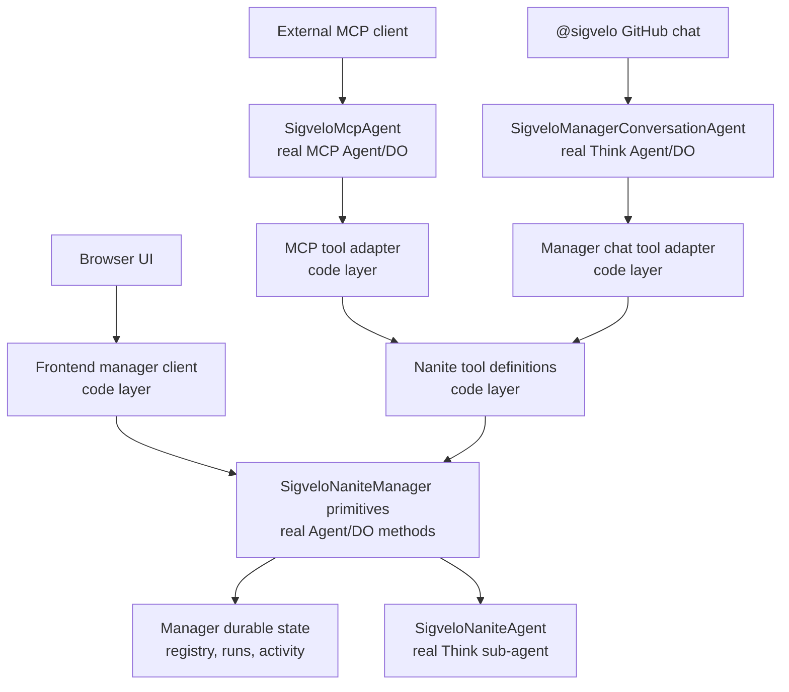

# Nanite tool surface LLD

## Purpose

This document defines the low-level design for the user-facing Nanite manager tool surface.

The goal is one product API with multiple entrypoints. MCP clients, the browser UI, and manager chat
should all reach the same manager operations. The implementation should not grow separate MCP,
browser, and chat versions of create, start, debug, or delete behavior.

The design keeps a sharp split between real Durable Object and Agent layers, which own state and runtime behavior, and code-only layers, which define and adapt tools.

## Decision

Define Nanite manager actions as **MCP-style tool definitions** in plain TypeScript. These definitions are the single source of truth for tool names, descriptions, input schemas, and handler behavior.

The MCP server registers those definitions directly with the MCP TypeScript SDK. Manager chat calls
the same definitions from server code. The browser stays native to Agents SDK stubs and uses small
frontend helpers over the manager methods it needs.

Do not make MCP transport the internal API. MCP is the native external machine API, but the shared abstraction is the tool definition module.

Do not add per-tool scopes for v1. The user-facing manager surface is limited by installation authorization and by Nanite runtime capability validation, not by different permissions per surface.

## Layer map



## Real Agent and Durable Object layers

### `SigveloNaniteManager`

`SigveloNaniteManager` is the authoritative installation control-plane Agent/DO.

There is one manager per GitHub installation:

```text
installation:{githubInstallationId}
```

The manager owns durable state and manager-owned behavior:

- Nanite registry
- run records and run ordering
- runtime activity summaries
- generated trigger execution and dispatch
- GitHub feedback surfaces
- child Nanite sub-agent creation, lookup, schedule sync, cancellation, and deletion

The manager exposes typed callable primitives such as `registerNanite`, `startNaniteManualRun`,
`testNaniteTrigger`, `cancelRuns`, and `inspectNaniteDebug`. MCP and manager-chat tool handlers
compose those primitives. The browser can call the primitives it needs through Agents SDK stubs
without routing through the MCP-style tool handlers.

### `SigveloNaniteAgent`

`SigveloNaniteAgent` is the real Think sub-agent for one Nanite.

It owns runtime behavior that belongs to the Nanite:

- Think transcript
- Think durable submissions
- Think session, context, and memory
- live token streaming
- workspace and file inspection
- MCP attachments
- lifecycle tools such as `complete`, `no_change`, `fail`, and `ask_human`

The tool registry never owns Nanite runtime state. It can ask the manager to delegate to a child Nanite for debug, transcript, submission, or workspace inspection.

### `SigveloMcpAgent`

`SigveloMcpAgent` is the real MCP server Agent/DO.

It does not own Nanite state. It adapts MCP tool calls into Nanite tool definitions, builds trusted `NaniteToolContext` from MCP auth props, resolves the authorized manager, and returns MCP `structuredContent`.

### `SigveloManagerConversationAgent`

`SigveloManagerConversationAgent` is the real Think Agent/DO for the conversational manager surface.

It does not own Nanite state. When a user tags or messages the manager, this agent resolves the prompting GitHub user and installation, builds `surface: "manager_chat"` context, and calls the same Nanite tool definitions.

The manager chat agent gets no special authority. It acts on behalf of the prompting user.

## Code-only layers

### Nanite tool definitions

The tool definition module is plain TypeScript. It is not a Durable Object, not an Agent, and not a second manager.

It defines:

- MCP-compatible name, title, description, annotations, and input schema
- one handler function per tool
- TypeScript output types derived from the manager methods that own those shapes

The handler receives parsed input and trusted product context. It composes real manager primitives.

The handler also receives an explicit manager runtime. MCP and manager-chat adapters pass a manager
stub. Browser code does not execute these handlers.

### MCP adapter

The MCP adapter runs inside `SigveloMcpAgent`.

It registers each tool definition with the MCP TypeScript SDK. The SDK validates MCP input against the registered input schemas. The adapter should not duplicate parsing around every tool.

The adapter only does MCP-specific work:

- get MCP auth props
- build `NaniteToolContext`
- call the tool handler
- return `structuredContent` and a text fallback

### Browser frontend client

The browser uses Agents SDK typed stubs against `SigveloNaniteManager`.

The frontend may define small helper functions for UI ergonomics:

```ts
deleteNanite(manager.stub, input);
refreshNaniteDebug(manager.stub, input);
startNaniteRunFromUi(manager.stub, input);
```

Those helpers live in frontend code and call typed manager stubs. They are not a second backend tool
surface.

Browser code does not pass trusted actor context. Browser authorization remains the existing browser
session and manager name boundary.

### Manager chat adapter

The manager chat adapter runs inside `SigveloManagerConversationAgent`.

It resolves the GitHub message author and installation, builds `surface: "manager_chat"` context, and calls the same tool handlers. The adapter may present those tools to the model through MCP or call them directly from server code, but the underlying handler remains the same.

## Tool context

Every MCP-style tool execution uses a GitHub user actor.

```ts
export type NaniteToolSurface = "mcp" | "manager_chat";

export type NaniteToolContext = {
  surface: NaniteToolSurface;
  actor: {
    kind: "github_user";
    githubUserId: number;
    githubLogin: string;
  };
  githubInstallationId: number;
  managerName: string;
  requestId: string;
};
```

`surface` is mandatory. It is telemetry and provenance, not authorization.

`managerName` is internal routing context derived from the GitHub installation. Do not expose it in
public tool input schemas or model-facing tool outputs.

`actor` is mandatory. User-initiated manager work always acts as the prompting GitHub user. If the
user tags `@sigvelo` in GitHub chat, that GitHub author becomes the actor. If the user calls the MCP
server, the MCP token's GitHub user becomes the actor. Browser calls use the existing browser
session and typed manager stubs rather than this tool context.

System maintenance is not part of this public tool surface. It should remain bounded internal manager code instead of pretending to be a GitHub user.

## Authorization model

Do not add per-tool read/write scopes in v1.

The user-facing manager tool surface is limited by these checks:

1. The actor is an authenticated GitHub user.
2. The actor is allowed to operate the selected GitHub installation.
3. The selected manager is derived from `githubInstallationId`; public tool inputs do not accept a
   manager name.
4. Nanite manifests and generated runtime permissions stay inside that installation boundary.
5. Nanite runtime GitHub/MCP/workspace authority is constrained by the validated Nanite manifest.

MCP OAuth may still advertise existing scopes for compatibility. The v1 tool model should not branch behavior by per-tool scope unless a real product boundary appears.

## Canonical tool shape

Use MCP SDK concepts as the shape of the registry.

```ts
import type { ToolAnnotations } from "@modelcontextprotocol/sdk/types.js";
import { z } from "zod";

export type NaniteManagerToolRuntime = Pick<
  NaniteManager,
  | "cancelRuns"
  | "deprovisionNanite"
  | "exploreNaniteWorkspace"
  | "inspectNaniteDebug"
  | "registerNanite"
  | "resetNaniteDebug"
  | "startNaniteManualRun"
  | "testNaniteTrigger"
>;

export type NaniteToolRuntime = {
  context: NaniteToolContext;
  manager: NaniteManagerToolRuntime;
};

export type NaniteTool<TInputSchema extends z.ZodType, TOutput> = {
  name: string;
  config: {
    title: string;
    description: string;
    inputSchema: TInputSchema;
    annotations?: ToolAnnotations;
  };
  handler(input: z.output<TInputSchema>, runtime: NaniteToolRuntime): Promise<TOutput>;
};
```

The tool definition owns the input schema and handler. The input schema is the runtime boundary for
agent/tool calls. The output contract is a TypeScript return type derived from the manager method
that already owns that shape.

Do not add MCP output schemas for v1. They duplicate the typed manager return contracts and make MCP
discovery/runtime behavior depend on a second schema copy. If a future external API needs runtime
output validation, add that at the API boundary instead of making every manager tool carry a parallel
output schema.

Prefer plain object exports with `satisfies`. Do not add a `defineNaniteTool(...)` helper unless
TypeScript inference genuinely needs it. The tool files should read like a list of product tools,
not a framework.

For MCP, the SDK validates input. The handler can assume `input` has already been parsed by the SDK.
The adapter returns `structuredContent`, but does not advertise an `outputSchema`.

For browser stubs, the callable input is typed and same-origin. The browser path can stay as frontend
helpers over manager stubs unless a workflow needs a new composed backend operation.

## Example tool definition

```ts
export const startNaniteRunTool = {
  name: "sigvelo_start_nanite_run",
  config: {
    title: "Start a Sigvelo Nanite run",
    description:
      "Starts a direct manual run for one registered Nanite and dispatches it through the real Nanite manager path.",
    inputSchema: startNaniteRunInputSchema,
  },
  async handler(input, { context, manager }) {
    return manager.startNaniteManualRun({
      naniteId: input.naniteId,
      message: input.message,
      actorId: `github:${context.actor.githubUserId}`,
      manualRequestId: input.manualRequestId ?? context.requestId,
    });
  },
} satisfies NaniteTool<typeof startNaniteRunInputSchema, StartNaniteManualRunOutput>;
```

The handler composes real manager primitives. It does not mutate state directly and does not duplicate manager-owned transition logic.

## Manager tools module

The shared module should be declarative. Keep the context type, schemas, explicit tool objects, and
small helper functions in one backend module:

```text
src/backend/nanites/tools/index.ts
```

Export each tool by name, and keep an ordered list only for tests, documentation, and MCP
registration assertions.

```ts
export const naniteTools = [
  createNaniteTool,
  debugNanitesTool,
  deprovisionNaniteTool,
  startNaniteRunTool,
  cancelNaniteRunsTool,
  testNaniteTriggerTool,
  exploreNaniteWorkspaceTool,
  resetNaniteDebugTool,
] as const;

export type NaniteToolName = (typeof naniteTools)[number]["name"];
```

Do not use a lookup map for normal dispatch. MCP registration and manager chat should import the
tool they call and name it directly. Repetition is preferable to a hidden command bus.

`sigvelo_whoami` stays adapter-local because it reports MCP auth token context and does not call
manager state.

## MCP adapter

MCP registration should be explicit. Register each canonical tool with the MCP SDK using its own
definition. A tiny result-format helper is acceptable, but avoid a generic registration loop as the
primary implementation pattern.

```ts
server.registerTool(startNaniteRunTool.name, startNaniteRunTool.config, async (input) => {
  const runtime = await buildMcpNaniteToolRuntime();
  const output = await startNaniteRunTool.handler(input, runtime);

  return {
    structuredContent: output,
    content: [{ type: "text", text: JSON.stringify(output, null, 2) }],
  };
});

server.registerTool(deprovisionNaniteTool.name, deprovisionNaniteTool.config, async (input) => {
  const runtime = await buildMcpNaniteToolRuntime();
  const output = await deprovisionNaniteTool.handler(input, runtime);

  return {
    structuredContent: output,
    content: [{ type: "text", text: JSON.stringify(output, null, 2) }],
  };
});
```

The MCP SDK handles input validation for MCP calls:

- `inputSchema` validates `request.params.arguments`
- TypeScript locks the handler return type at build time
- `structuredContent` carries the returned object for clients and model-readable JSON mirrors it in `content`

The adapter should not manually parse every input. It should not runtime-parse owned manager outputs.

The explicit registration makes drift visible in code review. If a tool is missing from MCP, the
absence is a visible missing `server.registerTool(...)` block instead of a hidden filter, loop, or
metadata bug.

## Browser frontend client

The browser does not need to execute MCP-style tool handlers.

The UI should call typed manager stubs directly, wrapped in small frontend functions when that makes
the component code cleaner. This keeps browser code native to the Agents SDK and avoids backend
forwarding methods that exist only for symmetry.

```ts
export async function deleteNaniteFromUi(
  manager: NaniteManager["stub"],
  input: { naniteId: string; accountLogin: string },
): Promise<DeprovisionNaniteOutput> {
  return manager.deprovisionNanite({
    naniteId: input.naniteId,
    reason: `Deleted from the Nanites UI for ${input.accountLogin}.`,
  });
}
```

The frontend helper repeats the intent in browser language. The backend manager method remains the
real operation.

If a browser workflow needs a composed operation that only exists as an MCP tool, choose deliberately:

- if the UI genuinely needs that product action, add an explicit manager callable for it
- if the UI can call an existing manager primitive directly, keep it as a frontend helper
- if the action is agent/operator-only, do not expose it in the browser

Do not add a backend callable whose only job is to call a tool handler so the browser path looks like
MCP. Symmetry is less important than an obvious call path.

## Manager chat adapter

Manager chat should call the same tools as the user who prompted it.

```ts
const runtime = {
  context: {
    surface: "manager_chat",
    actor: {
      kind: "github_user",
      githubUserId: chatContext.author.githubUserId,
      githubLogin: chatContext.author.githubLogin,
    },
    githubInstallationId: chatContext.githubInstallationId,
    managerName: buildNaniteManagerKey(chatContext.githubInstallationId),
    requestId: chatContext.messageId,
  },
  manager,
} satisfies NaniteToolRuntime;

const output = await startNaniteRunTool.handler(input, runtime);
```

The manager chat agent should not receive a broader manager credential. It can inspect, create, update, deprovision, or start Nanites only as the prompting user inside the selected installation.

## Manager primitives

The MCP and manager-chat tools compose existing manager primitives. Those primitives stay explicit.

Examples:

```text
sigvelo_create_nanite
  -> manager.registerNanite(...)

sigvelo_start_nanite_run
  -> manager.startNaniteManualRun(...)

sigvelo_deprovision_nanite
  -> manager.deprovisionNanite(...)

sigvelo_debug_nanites
  -> manager.inspectNaniteDebug(...)
  -> manager may delegate to child Nanite for transcript/submissions

sigvelo_explore_nanite_workspace
  -> manager.exploreNaniteWorkspace(...)
  -> manager delegates to child Nanite workspace inspection

sigvelo_test_nanite_trigger
  -> manager.testNaniteTrigger(...)
```

Avoid dynamic dispatch such as:

```ts
manager[tool.managerMethod](input, context);
```

Prefer explicit handler code. More boilerplate is acceptable when it keeps type relationships obvious.

## Public v1 tools

The initial public tool surface should be:

| Tool                               | Purpose                                                       | Manager behavior                                                    |
| ---------------------------------- | ------------------------------------------------------------- | ------------------------------------------------------------------- |
| `sigvelo_whoami`                   | Show the current actor and installation context.              | May be adapter-local or context-only.                               |
| `sigvelo_create_nanite`            | Create or update one Nanite manifest.                         | Validate repository scope, then register on manager.                |
| `sigvelo_debug_nanites`            | Inspect manager state and optional child Think runtime state. | Read manager state and delegate child debug when requested.         |
| `sigvelo_deprovision_nanite`       | Remove one registered Nanite and its child agent.             | Call manager deprovision flow.                                      |
| `sigvelo_start_nanite_run`         | Start a manual Nanite run.                                    | Create run, dispatch to child Think Nanite, optionally wait.        |
| `sigvelo_cancel_nanite_runs`       | Cancel pending or running runs.                               | Call manager cancellation flow and child cancellation where needed. |
| `sigvelo_test_nanite_trigger`      | Exercise generated trigger acceptance path.                   | Build fixture, test generated trigger, dispatch accepted runs.      |
| `sigvelo_explore_nanite_workspace` | Read child Nanite workspace info, files, listings, or search. | Delegate to child Nanite workspace API through manager.             |
| `sigvelo_reset_nanite_debug`       | Reset child runtime debug state.                              | Ask manager to reset child-owned debug state.                       |

Because Nanites are still pre-production, do not keep a compatibility wrapper. Agents should compose the explicit tools above instead of using a multi-action dispatcher.

## Output rules

All public tool outputs should be object-rooted so they can be used as MCP `structuredContent`.

Prefer this:

```ts
{
  ok: true,
  naniteId,
  runs,
}
```

Avoid array or scalar roots:

```ts
[{ runId: "..." }];
```

If a natural output is a list, wrap it:

```ts
{
  items: [...],
}
```

MCP output should include both structured content and text content:

```ts
{
  structuredContent: output,
  content: [{ type: "text", text: JSON.stringify(output, null, 2) }],
}
```

## Migration plan

1. Add `manager-tools.ts` under `src/backend/nanites/`.
2. Move MCP-specific helper logic that composes manager operations into tool handlers.
3. Register MCP tools from the registry instead of hand-writing each handler in `src/backend/mcp/index.ts`.
4. Add frontend helper functions for browser workflows that need clearer UI-level names.
5. Keep the UI on typed manager stubs unless a browser workflow needs a new composed manager callable.
6. Update manager chat instructions and adapter code to call the same explicit tools.
7. Keep lower-level manager primitives for webhooks, generated trigger dispatch, lifecycle tools, and child Nanite runtime callbacks.
8. Do not add compatibility tools while Nanites are pre-production; keep the surface explicit.

## Test plan

Add parity and behavior tests around the registry.

### Registry parity

Assert that every canonical public tool is registered for MCP.

Assert that browser helper functions intentionally call existing manager stubs. Do not require every
MCP tool to have a browser wrapper.

Assert that compatibility tools are explicitly marked as compatibility, not accidentally treated as canonical.

### MCP behavior

Use MCP `tools/list` to verify the registered tool names, descriptions, and input schemas.

Use MCP `tools/call` for representative tools:

- `sigvelo_whoami`
- `sigvelo_create_nanite`
- `sigvelo_debug_nanites`
- `sigvelo_deprovision_nanite`
- `sigvelo_start_nanite_run`

Assert that outputs include `structuredContent`.

### Browser behavior

Use typed manager stubs in focused tests for browser workflows that create, delete, and inspect Nanites.

The browser should never pass actor context. Browser workflows should use the existing authenticated
session and manager-name checks.

### Manager chat behavior

Test that manager chat builds context from the prompting GitHub author.

Test that `@sigvelo` work uses the same tool handler path as MCP calls.

### Runtime boundary

Test that Nanite runtime capability validation still happens at creation and update.

Test that child Nanite lifecycle calls do not become public manager tools.

## Non-goals

Do not introduce a parallel HTTP control surface for v1. Manager control should stay on Agents SDK callable methods and MCP tools unless a browser workflow genuinely needs a thin route.

Do not make MCP transport the only internal path. The browser should keep Agents SDK stubs and direct Nanite sub-agent chat.

Do not add per-tool scopes until there is a real authorization boundary. Installation authorization and Nanite capability constraints are enough for v1.

Do not create a generic manager command bus. Explicit tool handlers and explicit manager primitives are easier to reason about and safer to evolve.

Do not model system maintenance as a GitHub user. Scheduled maintenance remains bounded internal manager behavior.

## Open implementation questions

If a future browser workflow needs a composed backend operation, the manager should derive any
trusted user and installation context from existing browser auth/session state or authenticated
connection metadata. The browser should not send trusted actor fields.

The current MCP server advertises `nanites:read` and `nanites:write` scopes. The implementation can keep that OAuth compatibility while the internal tool model ignores per-tool scopes.

`sigvelo_whoami` should be intentionally classified. If it is an auth diagnostic, keep it adapter-local. If it is part of the parity surface, include it in `naniteTools` as a context-only tool.

Do not ship `sigvelo_poke_nanite`. The explicit tools cover the same operations and are easier for agents and UI code to call without action-dispatch branching.
