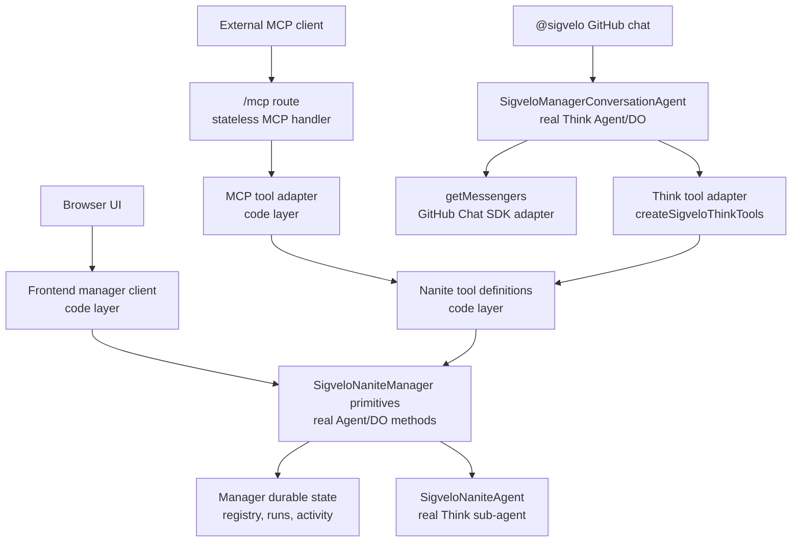

# Nanite tool surface LLD

## Purpose

This document defines the low-level design for the user-facing Nanite manager tool surface.

The goal is one product API with multiple entrypoints. MCP clients, the browser UI, and manager chat
should all reach the same manager operations. The implementation should not grow separate MCP,
browser, and chat versions of create, start, debug, or delete behavior.

The design keeps a sharp split between real Durable Object and Agent layers, which own state and runtime behavior, and code-only layers, which define and adapt tools.

## Decision

Define Nanite manager actions as **MCP-style tool definitions** in plain TypeScript. These
definitions are the single source of truth for tool names, descriptions, input schemas, output
schemas, scope checks, telemetry, and handler behavior.

The MCP route registers those definitions with the MCP TypeScript SDK. Manager chat exposes the same
definitions as Think tools through `createSigveloThinkTools()`. The browser stays native to Agents
SDK stubs and uses small frontend helpers over the manager methods it needs.

Do not make MCP transport the internal API. MCP is the native external machine API, but the shared abstraction is the tool definition module.

Keep v1 scopes coarse. The registry has `requiredScope` for MCP read/write gating, but product
authority still comes from deployment-installation authorization and Nanite runtime capability
validation. Do not add fine-grained product scopes until a real boundary appears.

## Layer map



## Real Agent and Durable Object layers

### `SigveloNaniteManager`

`SigveloNaniteManager` is the authoritative installation control-plane Agent/DO.

There is one manager per GitHub installation:

```text
app:{githubAppId}:installation:{githubInstallationId}
```

The manager owns durable state and manager-owned behavior:

- Nanite registry
- run records and run ordering
- runtime activity summaries
- generated trigger execution and dispatch
- GitHub feedback surfaces
- child Nanite sub-agent creation, lookup, schedule sync, cancellation, and deletion

The manager exposes typed callable primitives such as `registerNanite`, `startNaniteManualRun`,
`testNaniteTrigger`, `cancelRuns`, and `inspectNaniteDebug`. MCP and manager-chat tool handlers
compose those primitives. The browser can call the primitives it needs through Agents SDK stubs
without routing through the MCP-style tool handlers.

### `SigveloNaniteAgent`

`SigveloNaniteAgent` is the real Think sub-agent for one Nanite.

It owns runtime behavior that belongs to the Nanite:

- Think transcript
- Think durable submissions
- Think session, context, and memory
- live token streaming
- workspace and file inspection
- MCP attachments
- structured Run output through `NaniteRunWorkflow`

The tool registry never owns Nanite runtime state. It can ask the manager to delegate to a child Nanite for debug, transcript, submission, or workspace inspection.

### MCP route

`src/backend/mcp/index.ts` is the stateless MCP server route.

It does not own Nanite state. It validates `SigveloMcpAuthProps`, creates a fresh `McpServer` per
request, registers the Nanite tool registry, adapts MCP tool calls into `executeSigveloNaniteTool()`,
and returns MCP `structuredContent`.

### `SigveloManagerConversationAgent`

`SigveloManagerConversationAgent` is the real Think Agent/DO for the conversational manager surface.

It owns the manager conversation transcript and workspace, but not Nanite runtime state. Its
`getMessengers()` method uses Think `defineMessengers()` plus `chatSdkMessenger()` with the GitHub
Chat SDK adapter. When a user tags or messages the manager, the agent resolves the prompting GitHub
user against the deployment installation and exposes the same Nanite tool definitions as
`surface: "manager_chat"` Think tools.

The manager chat agent gets no special authority. It acts on behalf of the prompting user.

## Code-only layers

### Nanite tool definitions

The tool definition module is plain TypeScript. It is not a Durable Object, not an Agent, and not a second manager.

It defines:

- MCP-compatible name, title, description, annotations, input schema, and output schema
- one `execute` function per tool
- the required MCP scope
- TypeScript output types derived from the manager methods that own those shapes

The handler receives parsed input and trusted product context. It composes real manager primitives.

`executeSigveloNaniteTool()` resolves the authorized manager runtime from `SigveloMcpAuthProps`.
MCP and manager-chat adapters pass the same auth shape with different `surface` values. Browser code
does not execute these handlers.

### MCP adapter

The MCP adapter runs inside `src/backend/mcp/index.ts`.

It registers every tool definition with the MCP TypeScript SDK. The SDK validates MCP input against
the registered input schemas, and the shared executor parses again at the registry boundary so MCP
and Think tool calls have the same safety check.

The adapter only does MCP-specific work:

- validate MCP OAuth props
- register the canonical `naniteTools` list
- call `executeSigveloNaniteTool()`
- return `structuredContent` and a text fallback

### Browser frontend client

The browser uses Agents SDK typed stubs against `SigveloNaniteManager`.

The frontend may define small helper functions for UI ergonomics:

```ts
deleteNanite(manager.stub, input);
refreshNaniteDebug(manager.stub, input);
startNaniteRunFromUi(manager.stub, input);
```

Those helpers live in frontend code and call typed manager stubs. They are not a second backend tool
surface.

Browser code does not pass trusted actor context. Browser authorization remains the existing browser
session and manager name boundary.

### Manager chat adapter

The manager chat adapter runs inside `SigveloManagerConversationAgent`.

`getMessengers()` handles the GitHub Chat SDK ingress. `getTools()` calls `createSigveloThinkTools()`
after the conversation is connected to the deployment installation. That adapter converts the same
tool registry into AI SDK tools with `surface: "manager_chat"`.

## Tool context

Every MCP-style tool execution uses a GitHub user actor.

```ts
export type NaniteToolSurface = "mcp" | "manager_chat";

export type NaniteToolContext = {
  surface: NaniteToolSurface;
  actor: ObservabilityActor;
  githubAppId: number;
  githubInstallationId: number;
  managerName: string;
  requestId: string;
};
```

`surface` is mandatory. It is telemetry and provenance, not authorization.

`managerName` is internal routing context derived from the GitHub installation. Do not expose it in
public tool input schemas or model-facing tool outputs.

`actor` is mandatory. User-initiated manager work always acts as the prompting GitHub user. If the
user tags `@sigvelo` in GitHub chat, that GitHub author becomes the actor. If the user calls the MCP
server, the MCP token's GitHub user becomes the actor. Browser calls use the existing browser
session and typed manager stubs rather than this tool context.

System maintenance is not part of this public tool surface. It should remain bounded internal manager code instead of pretending to be a GitHub user.

## Authorization model

Do not add fine-grained product scopes in v1.

The user-facing manager tool surface is limited by these checks:

1. The actor is an authenticated GitHub user.
2. The actor is allowed to operate the deployment GitHub installation.
3. The deployment manager is derived from `githubAppId` and `githubInstallationId`; public tool
   inputs do not accept a manager name.
4. Nanite manifests and generated runtime permissions stay inside that installation boundary.
5. Nanite runtime GitHub/MCP/workspace authority is constrained by the validated Nanite manifest.

MCP OAuth may advertise read/write scopes. The v1 tool model should not branch behavior by
fine-grained product scope unless a real product boundary appears.

## Canonical tool shape

Use MCP SDK concepts as the shape of the registry.

```ts
import type { ToolAnnotations } from "@modelcontextprotocol/sdk/types.js";
import { z } from "zod";

export type NaniteToolRuntime = {
  context: NaniteToolContext;
  auth: SigveloMcpAuthProps;
  env: Env;
  manager: NaniteManager;
};

export type NaniteTool<TInputSchema extends z.ZodType, TOutput> = {
  name: string;
  title: string;
  description: string;
  inputSchema: TInputSchema;
  outputSchema: z.ZodType;
  requiredScope: SigveloMcpScope;
  annotations?: ToolAnnotations;
  execute(input: z.output<TInputSchema>, runtime: NaniteToolRuntime): Promise<TOutput>;
};
```

The tool definition owns the input schema and handler. The input schema is the runtime boundary for
agent/tool calls. The output contract is a TypeScript return type derived from the manager method
that already owns that shape, plus a Zod output schema for MCP and AI SDK tool metadata.

Most tools can use `createObjectOutputSchema(...)`, which keeps the registry object-rooted without
trying to mirror every manager return type in Zod. Use a specific output schema when the output is
itself a public discovery contract, such as `sigvelo_whoami`.

Use `defineSigveloMcpTool(...)` with `satisfies` so every registry entry has the same fields while
the individual tool files still read like product tools.

For MCP, the SDK validates input. The shared executor also parses at the registry boundary because
manager chat uses the same executor through AI SDK tools. The adapter returns `structuredContent`
and a model-readable JSON text fallback.

For browser stubs, the callable input is typed and same-origin. The browser path can stay as frontend
helpers over manager stubs unless a workflow needs a new composed backend operation.

## Example tool definition

```ts
export const startNaniteRunTool = defineSigveloMcpTool({
  name: "sigvelo_start_nanite_run",
  title: "Start a SigVelo Nanite run",
  description:
    "Starts a direct manual run for one registered Nanite and dispatches it through the real Nanite manager path.",
  inputSchema: startNaniteRunInputSchema,
  outputSchema: createObjectOutputSchema("SigVelo Nanite manual run start result."),
  requiredScope: MCP_SCOPES.write,
  async execute(input, { context, manager }) {
    return manager.startNaniteManualRun({
      naniteId: input.naniteId,
      message: input.message,
      actorId: `github:${context.actor.githubUserId}`,
      manualRequestId: input.manualRequestId ?? context.requestId,
    });
  },
} satisfies SigveloMcpToolDefinition<typeof startNaniteRunInputSchema, StartNaniteManualRunOutput>);
```

The handler composes real manager primitives. It does not mutate state directly and does not
duplicate manager-owned transition logic.

## Manager tools module

The shared module is declarative. Keep the context type, schemas, explicit tool objects, and small
helper functions in:

```text
src/backend/nanites/tools/index.ts
```

Export each tool by name, and keep one ordered list as the canonical registry for MCP and manager
chat adapters.

```ts
export const naniteTools = [
  whoamiTool,
  createNaniteTool,
  inspectDebugTool,
  deprovisionTool,
  startNaniteRunTool,
  cancelRunsTool,
  testNaniteTriggerTool,
  exploreWorkspaceTool,
  resetDebugTool,
] as const satisfies readonly AnySigveloMcpToolDefinition[];
```

Do not create per-surface copies of this list. MCP and manager chat should adapt the registry, not
redeclare it.

## MCP adapter

MCP registration is a small loop over the canonical registry. This is the only dispatch list; it
keeps the external tool surface visible without hand-writing the same adapter wrapper nine times.

```ts
for (const definition of naniteTools) {
  server.registerTool(
    definition.name,
    {
      title: definition.title,
      description: definition.description,
      inputSchema: definition.inputSchema,
      outputSchema: definition.outputSchema,
      annotations: definition.annotations,
      _meta: definition._meta,
    },
    async (toolInput, extra) =>
      formatMcpToolResult(
        await executeSigveloNaniteTool({
          definition,
          toolInput,
          invocation: {
            env,
            props: auth,
            surface: "mcp",
            requestId: extra.requestId == null ? undefined : String(extra.requestId),
          },
        }),
      ),
  );
}
```

The MCP SDK handles input validation for MCP calls:

- `inputSchema` validates `request.params.arguments`
- TypeScript locks the handler return type at build time
- `structuredContent` carries the returned object for clients and model-readable JSON mirrors it in `content`

The adapter should not manually parse every input or runtime-parse owned manager outputs. The
registry list is the review surface: if a tool should not be public, remove it from `naniteTools`.

## Browser frontend client

The browser does not need to execute MCP-style tool handlers.

The UI should call typed manager stubs directly, wrapped in small frontend functions when that makes
the component code cleaner. This keeps browser code native to the Agents SDK and avoids backend
forwarding methods that exist only for symmetry.

```ts
export async function deleteNaniteFromUi(
  manager: NaniteManager["stub"],
  input: { naniteId: string; accountLogin: string },
): Promise<DeprovisionNaniteOutput> {
  return manager.deprovisionNanite({
    naniteId: input.naniteId,
    reason: `Deleted from the Nanites UI for ${input.accountLogin}.`,
  });
}
```

The frontend helper repeats the intent in browser language. The backend manager method remains the
real operation.

If a browser workflow needs a composed operation that only exists as an MCP tool, choose deliberately:

- if the UI genuinely needs that product action, add an explicit manager callable for it
- if the UI can call an existing manager primitive directly, keep it as a frontend helper
- if the action is agent/operator-only, do not expose it in the browser

Do not add a backend callable whose only job is to call a tool handler so the browser path looks like
MCP. Symmetry is less important than an obvious call path.

## Manager chat adapter

Manager chat exposes the same registry as Think tools after it connects the conversation to the
deployment installation.

```ts
const sigveloTools =
  this.state.status === "connected"
    ? createSigveloThinkTools({
        env: this.env,
        auth: this.state.sigveloToolAuthProps,
      })
    : {};
```

`createSigveloThinkTools()` wraps each registry tool with `surface: "manager_chat"` and uses the
same `executeSigveloNaniteTool()` path as MCP. The manager chat agent should not receive a broader
manager credential. It can inspect, create, update, deprovision, or start Nanites only as the
prompting user inside the deployment installation.

## Manager primitives

The MCP and manager-chat tools compose existing manager primitives. Those primitives stay explicit.

Examples:

```text
sigvelo_create_nanite
  -> manager.registerNanite(...)

sigvelo_start_nanite_run
  -> manager.startNaniteManualRun(...)

sigvelo_deprovision_nanite
  -> manager.deprovisionNanite(...)

sigvelo_debug_nanites
  -> manager.inspectNaniteDebug(...)
  -> manager may delegate to child Nanite for transcript/submissions

sigvelo_explore_nanite_workspace
  -> manager.exploreNaniteWorkspace(...)
  -> manager delegates to child Nanite workspace inspection

sigvelo_test_nanite_trigger
  -> manager.testNaniteTrigger(...)
```

Avoid dynamic dispatch such as:

```ts
manager[tool.managerMethod](input, context);
```

Prefer explicit handler code. More boilerplate is acceptable when it keeps type relationships obvious.

## Public v1 tools

The public v1 tool surface is:

| Tool                               | Purpose                                                       | Manager behavior                                                    |
| ---------------------------------- | ------------------------------------------------------------- | ------------------------------------------------------------------- |
| `sigvelo_whoami`                   | Show the current actor and installation context.              | Reports auth/runtime context from the registry executor.            |
| `sigvelo_create_nanite`            | Create or update one Nanite manifest.                         | Validate repository scope, then register on manager.                |
| `sigvelo_debug_nanites`            | Inspect manager state and optional child Think runtime state. | Read manager state and delegate child debug when requested.         |
| `sigvelo_deprovision_nanite`       | Remove one registered Nanite and its child agent.             | Call manager deprovision flow.                                      |
| `sigvelo_start_nanite_run`         | Start a manual Nanite run.                                    | Create run, dispatch to child Think Nanite, optionally wait.        |
| `sigvelo_cancel_nanite_runs`       | Cancel pending or running runs.                               | Call manager cancellation flow and child cancellation where needed. |
| `sigvelo_test_nanite_trigger`      | Exercise generated trigger acceptance path.                   | Validate raw event, test generated trigger, dispatch accepted runs. |
| `sigvelo_explore_nanite_workspace` | Read child Nanite workspace info, files, listings, or search. | Delegate to child Nanite workspace API through manager.             |
| `sigvelo_reset_nanite_debug`       | Reset child runtime debug state.                              | Ask manager to reset child-owned debug state.                       |

Because Nanites are still pre-production, do not keep a compatibility wrapper. Agents should compose the explicit tools above instead of using a multi-action dispatcher.

## Output rules

All public tool outputs should be object-rooted so they can be used as MCP `structuredContent`.

Prefer this:

```ts
{
  ok: true,
  naniteId,
  runs,
}
```

Avoid array or scalar roots:

```ts
[{ runId: "..." }];
```

If a natural output is a list, wrap it:

```ts
{
  items: [...],
}
```

MCP output should include both structured content and text content:

```ts
{
  structuredContent: output,
  content: [{ type: "text", text: JSON.stringify(output, null, 2) }],
}
```

## Implementation status

- Tool definitions live under `src/backend/nanites/tools/`.
- `src/backend/mcp/index.ts` registers `naniteTools` with the MCP SDK.
- `SigveloManagerConversationAgent.getMessengers()` owns GitHub Chat SDK ingress through
  `chatSdkMessenger()`.
- `SigveloManagerConversationAgent.getTools()` exposes the same registry through
  `createSigveloThinkTools()`.
- The browser UI remains on typed Agents SDK stubs and frontend helpers.
- Lower-level manager primitives still serve webhooks, generated trigger dispatch, Workflow
  projection callbacks, and child Nanite runtime callbacks.
- There are no compatibility tools or old chat ingress shims.

## Test plan

Keep parity and behavior tests around the registry.

### Registry parity

Assert that every canonical public tool is registered for MCP.

Assert that browser helper functions intentionally call existing manager stubs. Do not require every
MCP tool to have a browser wrapper.

Assert that no compatibility tools or legacy chat ingress wrappers are registered as canonical.

### MCP behavior

Use MCP `tools/list` to verify the registered tool names, descriptions, and input schemas.

Use MCP `tools/call` for representative tools:

- `sigvelo_whoami`
- `sigvelo_create_nanite`
- `sigvelo_debug_nanites`
- `sigvelo_deprovision_nanite`
- `sigvelo_start_nanite_run`

Assert that outputs include `structuredContent`.

### Browser behavior

Use typed manager stubs in focused tests for browser workflows that create, delete, and inspect Nanites.

The browser should never pass actor context. Browser workflows should use the existing authenticated
session and manager-name checks.

### Manager chat behavior

Test that manager chat builds context from the prompting GitHub author.

Test that `@sigvelo` work uses the same tool handler path as MCP calls.

### Runtime boundary

Test that Nanite runtime capability validation still happens at creation and update.

Test that child Nanite lifecycle calls do not become public manager tools.

## Non-goals

Do not introduce a parallel HTTP control surface for v1. Manager control should stay on Agents SDK callable methods and MCP tools unless a browser workflow genuinely needs a thin route.

Do not make MCP transport the only internal path. The browser should keep Agents SDK stubs and direct Nanite sub-agent chat.

Do not add fine-grained product scopes until there is a real authorization boundary. Coarse MCP
read/write gating, deployment-installation authorization, and Nanite capability constraints are
enough for v1.

Do not create a generic manager command bus. Explicit tool handlers and explicit manager primitives are easier to reason about and safer to evolve.

Do not model system maintenance as a GitHub user. Scheduled maintenance remains bounded internal manager behavior.

## Open implementation questions

If a future browser workflow needs a composed backend operation, the manager should derive any
trusted user and installation context from existing browser auth/session state or authenticated
connection metadata. The browser should not send trusted actor fields.

The current MCP server advertises `nanites:read` and `nanites:write` scopes. The registry maps each
tool to one of those scopes; do not add narrower tool-specific grants until the product needs them.

Do not ship `sigvelo_poke_nanite`. The explicit tools cover the same operations and are easier for agents and UI code to call without action-dispatch branching.
