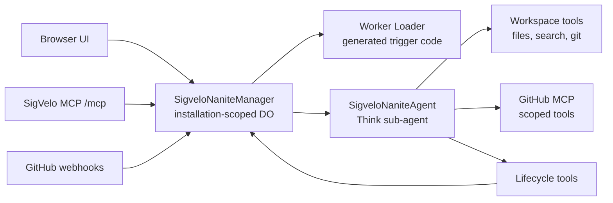

# SigVelo Agent App

The repository root is the Cloudflare Worker app that runs SigVelo.

It owns GitHub auth, deployment installation resolution, Nanite manager Durable Objects, Think sub-agents, generated trigger execution, the SigVelo MCP server, product UI, admin views, and observability.

## Runtime Shape



The manager owns policy and aggregate state. Think Nanites own transcript, streaming, workspace, tool loop, and lifecycle outcome.

## Key Areas

- `src/backend/agents/SigveloNaniteManager.ts` - installation manager, registry, routing, run summaries, and GitHub feedback.
- `src/backend/agents/SigveloNaniteAgent.ts` - stable Think Nanite runtime, workspace tools, GitHub-aware git auth, GitHub MCP codemode connector, lifecycle tools.
- `src/backend/nanites/triggers.ts` - Worker Loader execution for generated inbound trigger handlers.
- `src/backend/mcp/index.ts` - SigVelo MCP tools for model operators.
- `src/frontend/routes/_authenticated/nanites/route.tsx` - Nanites product UI.
- `wrangler.jsonc` - Cloudflare bindings, Durable Object migrations, vars, and required secrets.

## Prerequisites

Use the repo root toolchain:

```bash
vp install
```

For GitHub setup and inspection:

```bash
gh --version
gh auth status
gh api user --jq '{login,id}'
```

For Cloudflare setup and deploy:

```bash
vp exec wrangler whoami
```

## Required Cloudflare Resources

`wrangler.jsonc` expects:

- Worker assets
- Cloudflare Workers Paid plan for Dynamic Workers
- Durable Objects: `SigveloNaniteManager`, `SigveloNaniteAgent`
- Worker Loader binding: `LOADER`
- Workers AI binding: `AI`
- Browser binding: `BROWSER`
- D1 database bound as `DB`
- R2 bucket bound as `WORKSPACE_FILES`
- KV namespace bound as `OAUTH_KV` for OAuth state and prefixed tool-output artifacts

The external provisioner creates or configures deployment resources, including the
`sigvelo-nanites` AI Gateway. Runtime code only names that gateway with
`NANITES_AI_GATEWAY_ID` in `src/backend/nanites/language-model.ts`; change the provisioner and
redeploy if the gateway identity changes. The default model is `@cf/zai-org/glm-5.2` through the
Worker `AI` binding and AI Gateway, so local development does not depend on third-party provider
credentials.

AI Gateway event detail reads use `CLOUDFLARE_ACCOUNT_ID` and `CLOUDFLARE_API_TOKEN`. The token
needs AI Gateway Read access.

## Local Runtime Contract

Local development mirrors the provisioner contract:

- `AUTH_COOKIE_SECRET`
- `CLOUDFLARE_ACCOUNT_ID`
- `CLOUDFLARE_API_TOKEN`
- `GITHUB_APP_ID`
- `GITHUB_APP_SLUG`
- `GITHUB_APP_CLIENT_ID`
- `GITHUB_APP_PRIVATE_KEY`
- `GITHUB_APP_CLIENT_SECRET`
- `GITHUB_APP_WEBHOOK_SECRET`
- runtime-discovered installation rows in `accounts`, `accountInstallations`, and
  `accountRepositories`

Run the local runtime:

```bash
cp docs/dev.vars.local.example .dev.vars
vp run db:migrate:local
vp run dev
```

### Local GitHub App settings

Use a GitHub App you own for local development. Copy its values into `.dev.vars` using the
deployment-level names above. Older local files may have keys like
`GITHUB_APP_<app-id>_PRIVATE_KEY`; rename those values to `GITHUB_APP_PRIVATE_KEY`,
`GITHUB_APP_CLIENT_SECRET`, and `GITHUB_APP_WEBHOOK_SECRET`.

Set the local app's OAuth callback URL to:

```text
http://localhost:5173/auth/github/callback
```

For webhook testing, GitHub cannot deliver to localhost directly. Either keep an inactive
placeholder webhook URL for UI/OAuth work, or use a public smee channel:

```bash
npx smee-client --url <channel> --target http://localhost:5173/api/github/webhook
```

The local app needs enough repository permissions for the Nanites you want to test. A broad local
maintenance app usually uses write access for Actions, Checks, Contents, Deployments, Issues, Pages,
Pull requests, Repository hooks, Repository projects, Secrets, and Workflows, plus read access for
Metadata.

For tests and local smoke data, use the helpers in `tests/helpers/d1-baseline.ts` or seed D1 with
the same installation projection shape the runtime discovers. Do not add setup routes or
deploy-time secret prompts back to this repo.

The Nanite runtime should prefer Workspace git plus GitHub MCP/Octokit for GitHub API work. Do not assume shell `gh` is authenticated inside a Nanite unless `GH_TOKEN` injection is explicitly added.

## Nanites MCP

The app exposes the model control plane at:

```text
/mcp
```

Core tools:

| Tool                               | Purpose                                                          |
| ---------------------------------- | ---------------------------------------------------------------- |
| `sigvelo_whoami`                   | Verify actor, installation, client, and scopes.                  |
| `sigvelo_create_nanite`            | Create or update a Nanite manifest.                              |
| `sigvelo_deprovision_nanite`       | Delete one Nanite and its run history.                           |
| `sigvelo_start_nanite_run`         | Start a manual Nanite run.                                       |
| `sigvelo_cancel_nanite_runs`       | Cancel pending or running Nanite runs.                           |
| `sigvelo_test_nanite_trigger`      | Test a raw GitHub event and dispatch accepted runs.              |
| `sigvelo_debug_nanites`            | Inspect manager state and optional Think transcript/submissions. |
| `sigvelo_explore_nanite_workspace` | Inspect child-owned workspace files.                             |

MCP tool calls are already bound to the authorized GitHub installation. Do not pass a manager name.
For `sigvelo_create_nanite`, keep the manifest to id, name, description, `eventSource`,
`triggerSource` for machine sources, and `permissions.github`. GitHub MCP tools are derived from
`permissions.github.appPermissions`; do not include MCP tiers, tool allowlists, or runtime
capability blocks.

Create and test Nanites one at a time. For related Nanite fleets, call `sigvelo_create_nanite` for
one Nanite, run `sigvelo_test_nanite_trigger` for that Nanite, then move to the next Nanite. Do not
try to call SigVelo tools from inside `execute`; `execute` is Worker-compatible JavaScript for
workspace and git provider work, and it does not expose SigVelo control-plane tools as top-level
functions.

For `sigvelo_test_nanite_trigger`, send a GitHub webhook-shaped event object with `id`, base
`name`, and `payload`. `payload.installation.id` must match the installation returned by
`sigvelo_whoami`; action-specific behavior belongs in `payload.action`.

Minimal MCP config:

```json
{
  "mcpServers": {
    "nanites": {
      "type": "http",
      "url": "http://localhost:5173/mcp"
    }
  }
}
```

Local browser and MCP smoke tests should use the real local GitHub App OAuth flow. `gh` is still
useful for checking the active GitHub account and normal repository API access, but a plain
`gh auth token` is a GitHub CLI token, not a GitHub App user token. GitHub rejects it for app-user
authorization surfaces such as `/user/installations`.

```bash
vp run dev
```

Open `http://localhost:5173/auth/github/login`, complete OAuth for the local Nanites app, and select
the intended installation in the UI. Then point MCPJam at the local server:

```bash
mcpjam oauth login \
  --url http://localhost:5173/mcp \
  --scopes "nanites:read nanites:write" \
  --verify-tools
```

The dev-only `/auth/test/mint-session` path is still available when `ALLOW_TEST_AUTH=true`, but it
requires a GitHub App user token minted by the app, not the GitHub CLI token.

## Generated Trigger Contract

Generated trigger handlers are Worker-compatible TypeScript.

Machine-originated Nanite manifests use `eventSource` for coarse intake and root `triggerSource` for
this generated code. Generated trigger handlers receive a trigger event whose GitHub payload stays in
GitHub's webhook shape, plus a small manager intent API:

```ts
export default {
  async handle(event, ctx) {
    if (event.name !== "push") {
      return ctx.noop("Not a push event.");
    }

    return ctx.dispatchSelf({
      reason: "Relevant push event",
      repository: event.payload.repository.full_name,
    });
  },
};
```

Supported helpers today:

- `ctx.dispatchSelf(input)`
- `ctx.noop(reason)`
- `ctx.record(message, data)`

Generated trigger handlers route events. They should not edit repositories, own lifecycle state, or bypass manager policy.

## Development

Run the app:

```bash
vp run db:migrate:local
vp run dev
```

Run app commands:

```bash
vp run dev
vp build
vp test
vp check
```

Validate from the repo root before merging:

```bash
vp check
vp test
```

Deployments are provisioner-owned. Build Nanites here; install or update it from `../sigvelo`.

## Testing

Use the root checks for normal work:

```bash
vp check
vp test
```

Nanites runtime changes should favor end-to-end tests that exercise real Worker/Agent boundaries, real signed webhooks, real Durable Object state, and real browser journeys where UI behavior matters.

## More Docs

- `docs/architecture/README.md`
- `docs/architecture/architecture.md`
- `docs/architecture/execution-architecture.md`
- `docs/architecture/roadmap.md`
- `docs/architecture/user-stories.md`
- `docs/nanites-auth-slice.md`
- `docs/testing-golden-standard.md`
