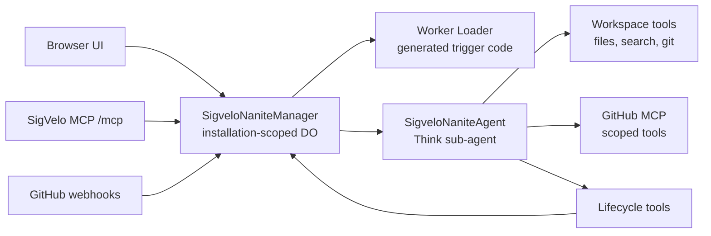

# SigVelo Agent App

The repository root is the Cloudflare Worker app that runs SigVelo.

It owns GitHub auth, installation selection, Nanite manager Durable Objects, Think sub-agents, generated trigger execution, the SigVelo MCP server, product UI, admin views, and observability.

## Runtime Shape



The manager owns policy and aggregate state. Think Nanites own transcript, streaming, workspace, tool loop, and lifecycle outcome.

## Key Areas

- `src/backend/agents/SigveloNaniteManager.ts` - installation manager, registry, routing, run summaries, and GitHub feedback.
- `src/backend/agents/SigveloNaniteAgent.ts` - stable Think Nanite runtime, workspace tools, GitHub-aware git auth, GitHub MCP codemode connector, lifecycle tools.
- `src/backend/nanites/triggers.ts` - Worker Loader execution for generated inbound trigger handlers.
- `src/backend/mcp/index.ts` - SigVelo MCP tools for model operators.
- `src/frontend/routes/_authenticated/nanites/route.tsx` - Nanites product UI.
- `wrangler.jsonc` - Cloudflare bindings, Durable Object migrations, vars, and required secrets.

## Prerequisites

Use the repo root toolchain:

```bash
vp install
```

For GitHub setup and inspection:

```bash
gh --version
gh auth status
gh api user --jq '{login,id}'
```

For Cloudflare setup and deploy:

```bash
vp exec wrangler whoami
```

## Required Cloudflare Resources

`wrangler.jsonc` expects:

- Worker assets
- Cloudflare Workers Paid plan for Dynamic Workers
- Durable Objects: `SigveloNaniteManager`, `SigveloNaniteAgent`
- Worker Loader binding: `LOADER`
- Workers AI binding: `AI`
- Browser binding: `BROWSER`
- D1 database bound as `DB`
- R2 bucket bound as `WORKSPACE_FILES`
- KV namespace bound as `OAUTH_KV`
- KV namespace bound as `TOOL_OUTPUTS`

Create/update resources with Wrangler or Cloudflare MCP:

```bash
vp exec wrangler d1 create nanites-db
vp exec wrangler r2 bucket create nanites-workspace-files
vp exec wrangler kv namespace create OAUTH_KV
vp exec wrangler kv namespace create TOOL_OUTPUTS
```

`/setup` uses Cloudflare API MCP with Billing Read to confirm the selected account has an active
Workers paid subscription. The default model is Cloudflare-hosted
`@cf/moonshotai/kimi-k2.7-code` through Workers AI and AI Gateway `default`; provider API keys are not
required unless a future deployment chooses non-Workers-AI models.

Apply database migrations before relying on an environment:

```bash
vp exec wrangler d1 migrations apply DB --remote --config wrangler.jsonc
```

## Local Runtime Secrets

Fresh self-hosted deploys should use the Deploy to Cloudflare button and `/setup`; that path creates
the customer-owned GitHub App and writes generated runtime secrets to Worker Secrets without
copy-paste. There are no hand-set GitHub secrets anywhere: runtime identity is a `github_apps` D1
row plus per-app secret bindings (`GITHUB_APP_<ID>_PRIVATE_KEY` and friends).

Local development gets the same identity through the dev-only `/setup/local` page instead of the
wizard (whose Cloudflare ownership verification cannot run on localhost). See
[Local GitHub App Setup](#local-github-app-setup).

The local `.dev.vars` template sets `NANITES_SHOW_SETUP=false` so normal local development does not
auto-route into the first-launch setup wizard. Set `NANITES_SHOW_SETUP=true` in `.dev.vars` only
when intentionally testing the setup flow.

Optional Sentry:

```bash
vp exec wrangler secret put SENTRY_DSN --config wrangler.production.jsonc
```

Setting the `SENTRY_DSN` secret enables both worker-side Sentry and browser-side Sentry — the
frontend reads the DSN at runtime from `/api/client-config`, so no rebuild is needed. (A build-time
`VITE_SENTRY_DSN` still takes precedence when set.) Keep non-sensitive runtime settings such as
`SENTRY_ENVIRONMENT` and `SENTRY_TRACES_SAMPLE_RATE` in `wrangler.jsonc` vars.

For local browser SDK or source-map upload settings, copy the Sentry/browser template only when you
need it:

```bash
cp docs/env.local.example .env
```

## Local GitHub App Setup

SigVelo needs a GitHub App installed on the repositories Nanites may maintain. For self-hosted
deployments, `/setup` creates the app. Locally, the dev-only `/setup/local` page (mounted only in
dev builds and only answering loopback hostnames) does the same job: it runs GitHub's app-manifest
flow with Nanites' default permissions and registers the resulting app in the local D1 database.

First-time setup (once per developer):

1. `cp docs/dev.vars.local.example .dev.vars`
2. `vp run db:migrate:local && vp run dev`
3. Open `http://localhost:5173/setup/local` and click **Create dev GitHub App on GitHub** — GitHub
   shows a pre-filled confirmation page; one click registers a personal dev app and returns here.
4. Append the printed secret block (`GITHUB_APP_<ID>_*` plus `AUTH_COOKIE_SECRET`) to `.dev.vars`
   and restart `vp run dev`. The worker cannot write `.dev.vars` itself; this is the only paste.
5. Optional: upload `public/assets/nanite-github-app-badge.png` as the app badge in GitHub App
   settings under **Display information**. GitHub App manifests cannot set badges.
6. Install the app on at least one repository (the page links to the install URL), then sign in at
   `http://localhost:5173` and activate the installation.

After any `rm -rf .wrangler` (the supported reset for stale local state), the secrets in
`.dev.vars` survive and the database row is rebuilt without a browser flow:

```bash
vp run db:migrate:local && vp run dev
curl -X POST http://localhost:5173/setup/local/restore
```

The dev app manifest uses an inactive `https://example.com/nanites-local-webhook` placeholder
because GitHub requires a hook URL but rejects localhost hook URLs. Local webhook behavior is
covered by the test suite. For live local webhooks, point the app's webhook URL at a public
[smee.io](https://smee.io) channel in GitHub settings, activate it, and run
`npx smee-client --url <channel> --target http://localhost:5173/api/github/webhook`.

The Nanite runtime should prefer Workspace git plus GitHub MCP/Octokit for GitHub API work. Do not assume shell `gh` is authenticated inside a Nanite unless `GH_TOKEN` injection is explicitly added.

## SigVelo MCP

The app exposes the model control plane at:

```text
/mcp
```

Core tools:

| Tool                               | Purpose                                                            |
| ---------------------------------- | ------------------------------------------------------------------ |
| `sigvelo_whoami`                   | Verify actor, installation, client, and scopes.                    |
| `sigvelo_create_nanite`            | Create or update a Nanite manifest.                                |
| `sigvelo_deprovision_nanite`       | Delete one Nanite and its run history.                             |
| `sigvelo_start_nanite_run`         | Start a manual Nanite run.                                         |
| `sigvelo_cancel_nanite_runs`       | Cancel pending or running Nanite runs.                             |
| `sigvelo_test_nanite_trigger`      | Build a fixture event, test a trigger, and dispatch accepted runs. |
| `sigvelo_debug_nanites`            | Inspect manager state and optional Think transcript/submissions.   |
| `sigvelo_explore_nanite_workspace` | Inspect child-owned workspace files.                               |

MCP tool calls are already bound to the authorized GitHub installation. Do not pass a manager name.
For `sigvelo_create_nanite`, keep the manifest to id, name, description, `eventSource`,
`triggerSource` for machine sources, and `permissions.github`. GitHub MCP tools are derived from
`permissions.github.appPermissions`; do not include MCP tiers, tool allowlists, or runtime
capability blocks.

Create and test Nanites one at a time. For related Nanite fleets, call `sigvelo_create_nanite` for
one Nanite, run `sigvelo_test_nanite_trigger` for that Nanite, then move to the next Nanite. Do not
try to call SigVelo tools from inside `execute`; `execute` is Worker-compatible JavaScript for
workspace and git provider work, and it does not expose SigVelo control-plane tools as top-level
functions.

For `sigvelo_test_nanite_trigger`, fixture overrides may use provider-shaped nested objects such as
`{ "repository": { "full_name": "WebMCP-org/npm-packages" } }` or dotted keys such as
`{ "repository.full_name": "WebMCP-org/npm-packages" }`.

Minimal MCP config:

```json
{
  "mcpServers": {
    "sigvelo": {
      "type": "http",
      "url": "https://app.sigvelo.com/mcp"
    }
  }
}
```

Local browser and MCP smoke tests should use the real local GitHub App OAuth flow. A plain
`gh auth token` is a GitHub CLI token, not a GitHub App user token, and GitHub rejects it for
`/user/installations`.

```bash
vp run dev
```

Open `http://localhost:5173/auth/github/login`, complete OAuth for the local/Sigvelo app, and select
the intended installation in the UI. Then point MCPJam at the local server:

```bash
mcpjam oauth login \
  --url http://localhost:5173/mcp \
  --scopes "nanites:read nanites:write" \
  --verify-tools
```

The dev-only `/auth/test/mint-session` path is still available when `ALLOW_TEST_AUTH=true`, but it
requires a GitHub App user token minted by the app, not the GitHub CLI token.

## Generated Trigger Contract

Generated trigger handlers are Worker-compatible TypeScript.

Machine-originated Nanite manifests use `eventSource` for coarse intake and root `triggerSource` for
this generated code. Generated trigger handlers receive a trigger event whose GitHub payload stays in
GitHub's webhook shape, plus a small manager intent API:

```ts
export default {
  async handle(event, ctx) {
    if (event.name !== "push") {
      return ctx.noop("Not a push event.");
    }

    return ctx.dispatchSelf({
      reason: "Relevant push event",
      repository: event.payload.repository.full_name,
    });
  },
};
```

Supported helpers today:

- `ctx.dispatchSelf(input)`
- `ctx.noop(reason)`
- `ctx.record(message, data)`

Generated trigger handlers route events. They should not edit repositories, own lifecycle state, or bypass manager policy.

## Development

Run the app:

```bash
vp run db:migrate:local
vp run dev
```

Run app commands:

```bash
vp run dev
vp build
vp test
vp check
```

Validate from the repo root before merging:

```bash
vp check
vp test
```

Deploy:

```bash
vp run deploy:prod
```

## Testing

Use the root checks for normal work:

```bash
vp check
vp test
```

Nanites runtime changes should favor end-to-end tests that exercise real Worker/Agent boundaries, real signed webhooks, real Durable Object state, and real browser journeys where UI behavior matters.

## More Docs

- `docs/architecture/README.md`
- `docs/architecture/architecture.md`
- `docs/architecture/execution-architecture.md`
- `docs/architecture/roadmap.md`
- `docs/architecture/user-stories.md`
- `docs/nanites-auth-slice.md`
- `docs/testing-golden-standard.md`
